# Finding a needle in Haystack: Facebook’s photo storage

**简述**: 本文介绍了 Haystack，一种针对 Facebook 的图片应用程序进行优化的对象存储系统。Facebook 目前存储超过 2600 亿张图片，相当于超过 20PB 的数据。用户每周上传 10 亿张新图片（约 60TB），在高峰期，Facebook 每秒提供超过 100 万张图片。Haystack 提供了比我们先前使用的基于 NFS 的网络附加存储设备更经济高效的解决方案。更关键的是，我们观察到这种传统设计会因元数据查找而产生过多的磁盘操作。我们通过精简每张图片的元数据，使 Haystack 存储机器能够在主内存中执行所有元数据查找。这种选择保留了用于读取实际数据的磁盘操作，从而增加了整体吞吐量。

-------

## 1. 介绍

分享图片是 Facebook 最受欢迎的功能之一。迄今为止，用户上传了超过 650 亿张图片，使 Facebook 成为全球最大的图片分享网站。对于每张上传的图片，Facebook 会生成并存储四个不同尺寸的图片，这相当于超过 2600 亿张图片和超过 20PB 的数据。每周用户上传 10 亿张新图片（约 60TB），在高峰期，Facebook 每秒提供超过 100 万张图片。我们预计未来这些数字将会增加，图片存储对于 Facebook 的基础设施构成了重大挑战。

本文介绍了 Haystack 的设计和实现，这是 Facebook 过去 24 个月中一直在使用的图片存储系统。Haystack 是一个为分享图片而设计的对象存储系统 [7, 10, 12, 13, 25, 26]，其中数据只写入一次，经常读取，从不修改，很少删除。我们为图片工作负载而设计了自己的存储系统，因为传统的文件系统在我们的工作负载下性能较差。

根据以往经验，传统的基于 Posix [21] 的文件系统的缺点在于目录和每个文件的元数据。对于图片应用程序，大多数此类元数据（例如权限）未被使用，因此会浪费存储容量。然而，更重要的成本是必须从磁盘读取文件的元数据到内存中，以便找到文件本身。虽然在小规模上不重要，但在数十亿张图片和 PB 级数据的情况下，访问元数据是吞吐量的瓶颈。我们发现，这是使用基于 NFS 的网络附加存储（NAS）设备时的主要问题。读取单个图片需要多次磁盘操作：一次（或通常多次）将文件名转换为 inode 编号，另一次从磁盘中读取 inode，最后一次读取文件本身。简而言之，使用磁盘 I/O 进行元数据操作是我们读取吞吐量的限制因素。实际上，这个问题还会带来额外的成本，因为我们必须依赖内容交付网络（CDN），例如 Akamai [2]，来服务大部分的读取流量。

鉴于传统方法的缺点，我们设计了 Haystack，以实现以下四个主要目标：

- **高吞吐量和低延迟**：我们的图片存储系统必须跟得上用户的请求。超出我们处理能力的请求要么被忽略，这对用户体验来说是不可接受的，要么由 CDN 处理，这既昂贵又达到了收益递减的点。此外，为了提供良好的用户体验，应该能够快速地提供图片。Haystack 通过每次读取最多只需要一次磁盘操作来实现高吞吐量和低延迟。我们通过将所有元数据存储在主内存中来实现这一点，并通过大幅减少每张图片在磁盘上查找所需的元数据来实现实用性。

- **容错性**：在大规模系统中，故障每天都会发生。我们的用户依赖于他们的图片可用，并且不应该遇到错误，尽管不可避免地会发生服务器崩溃和硬盘故障。可能会发生整个数据中心断电或跨国链接断开的情况。Haystack 将每张图片复制到地理位置不同的位置。如果我们丢失了一台机器，我们会引入另一台机器来替代它，并根据需要复制数据以进行冗余。

- **成本效益**：与我们之前基于 NFS 的方法相比，Haystack 性能更好，成本更低。我们通过两个维度量化我们的节省：Haystack 每可用存储 1 TB 的成本和每可用存储 1 TB 的读取速率。相比于 NAS 设备，在 Haystack 中，每个可用的 TB 成本降低约 28％，并且每秒处理的读取数提高约 4 倍。

- **简单易用**：在生产环境中，我们不能过分强调实现和维护简单的设计优点。由于 Haystack 是一个新系统，缺乏多年的生产级测试，因此我们特别注意保持其简单性。这种简单性使我们能够在几个月而不是几年内构建和部署一个可用的系统。

本文描述了我们从构思到实现一种每天服务数十亿张图片的生产级系统的经验。我们的三个主要贡献是：

- Haystack：一种针对高效存储和检索数十亿张图片进行优化的对象存储系统。
- 在构建和扩展一种廉价、可靠且可用的图片存储系统方面所学到的教训。
- 对 Facebook 图片分享应用程序的请求进行了表征。

我们将本文其余部分组织如下。第 2 节提供了背景，并强调了我们之前架构中面临的挑战。我们在第 3 节中描述了 Haystack 的设计和实现。第 4 节表征了我们的图片读写工作负载，并证明了 Haystack 满足我们的设计目标。我们在第 5 节中与相关工作进行比较，并在第 6 节中总结本文。

## 2. 背景 & 之前的设计

在本节中，我们描述了 Haystack 出现之前存在的架构，并强调了我们所学到的主要经验教训。由于篇幅限制，我们在讨论之前的设计时省略了生产级部署的一些细节。

### 2.1 背景

我们首先简要概述了网页服务器、内容传递网络（CDN）和存储系统相互交互以在流行网站上提供图片的典型设计。图 1 描绘了从用户访问包含图片的页面到她从磁盘上下载该图片的步骤。当用户访问页面时，浏览器首先向网页服务器发送一个 HTTP 请求，该服务器负责生成用于浏览器呈现的标记。对于每个图片，网页服务器构造一个 URL，指导浏览器从中下载数据的位置。对于流行的网站，该 URL 通常指向 CDN。如果 CDN 已经缓存了该图片，则 CDN 立即响应数据。否则，CDN 会检查 URL，其中包含足够的信息以从站点的存储系统检索图片。然后，CDN 更新其缓存数据并将图片发送到用户的浏览器。

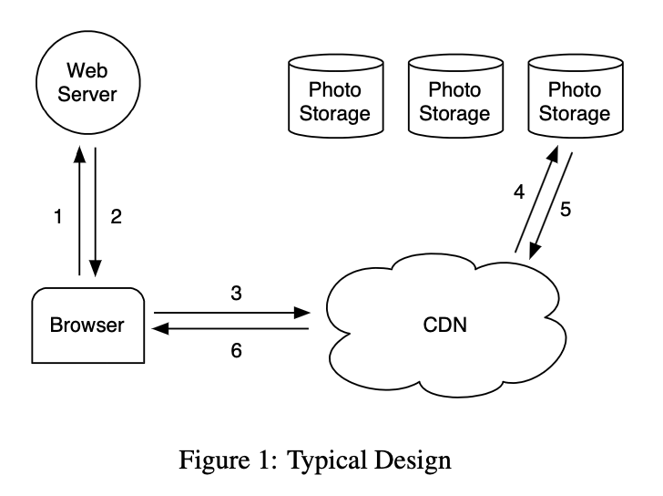

### 2.2 基于 NFS 的设计

在我们的第一个设计中，我们使用基于 NFS 的方法实现了图片存储系统。虽然本小节的其余部分提供了更多关于该设计的细节，但我们所学到的主要教训是，单独的 CDN 并不能为社交网络站点上的图片提供实际的解决方案。CDN 确实能够有效地提供最热门的图片 - 头像和最近上传的图片，但像 Facebook 这样的社交网络站点也会为较不受欢迎（通常是较旧的）内容产生大量请求，我们称之为长尾。长尾请求占据了我们流量的相当一部分，几乎所有这些请求都会访问后端的图片存储主机，因为这些请求通常在 CDN 中未被命中。尽管缓存所有这些长尾图片非常方便，但由于需要非常大的缓存，这样做并不具有成本效益。

我们基于 NFS 的设计将每个图片存储为商用 NAS 设备上的单独文件。然后，一组名为 “Photo Store” 服务器的机器通过 NFS 挂载这些 NAS 设备导出的所有卷。图 2 说明了这种架构，并显示了 Photo Store 服务器处理图片的 HTTP 请求。从图片的 URL 中，Photo Store 服务器提取卷和文件的完整路径，通过 NFS 读取数据，并将结果返回给 CDN。

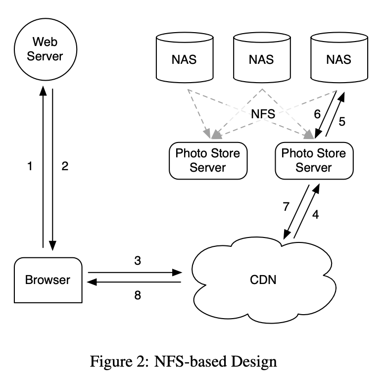

我们最初在每个 NFS 卷的每个目录中存储数千个文件，这导致即使读取单个图片也会产生过多的磁盘操作。由于 NAS 设备管理目录元数据的方式，将数千个文件放在一个目录中非常低效，因为目录的块映射表太大，无法被设备有效地缓存。因此，检索单个图片通常需要超过 10 次磁盘操作。将目录大小减小到每个目录数百张图片后，结果系统通常仍需要 3 次磁盘操作来获取图片：一次是将目录元数据读入内存，第二次是将 inode 加载到内存中，第三次是读取文件内容。

为了进一步减少磁盘操作，我们让 Photo Store 服务器明确地缓存 NAS 设备返回的文件句柄。当第一次读取文件时，Photo Store 服务器正常地打开文件，同时在 memcache 中缓存文件名到文件句柄的映射[18]。当请求一个已缓存文件句柄的文件时，Photo Store 服务器使用我们添加到内核中的自定义系统调用`open by filehandle`直接打开文件。遗憾的是，这个文件句柄缓存只提供了微小的改进，因为不受欢迎的图片不太可能被缓存在内存中。一种可能的解决方案是将所有文件句柄存储在 memcache 中，但这只解决了部分问题，因为它依赖于 NAS 设备在主内存中拥有所有的 inode，这对于传统的文件系统来说是一项昂贵的要求。我们从 NAS 方案中所学到的主要教训是，仅仅专注于缓存 - 无论是 NAS 设备的缓存还是像 memcache 这样的外部缓存 - 对于减少磁盘操作的影响非常有限。存储系统最终要处理较不受欢迎的图片的长尾请求，这些图片在 CDN 中不可用，因此很可能会在我们的缓存中未命中。

### 2.3 讨论

我们很难为何时（或何时不）构建自定义存储系统提供精确的指导。然而，我们认为让社区了解我们为什么决定构建 Haystack 仍然是有帮助的。

面对我们基于 NFS 的设计中的瓶颈，我们探索了是否构建类似于 GFS [9] 的系统。由于我们将大部分用户数据存储在 MySQL 数据库中，我们系统中文件的主要用例是工程师用于开发工作的目录、日志数据和图片。NAS 设备为开发工作和日志数据提供了非常好的价格/性能比。此外，我们利用 Hadoop [11] 处理极大的日志数据。但是 MySQL、NAS 设备和 Hadoop 都不太适合处理长尾图片。

我们面临的困境可以概括为现有存储系统缺乏适当的 RAM-to-disk 比率。然而，没有正确的比率。系统只需要足够的主内存，以便可以一次性缓存文件系统所有的元数据。在我们的基于 NAS 的方法中，一个图片对应一个文件，每个文件都需要至少一个 inode，而 inode 大小为几百个字节。在这种方法中，拥有足够的主内存是不划算的。为了实现更好的价格/性能比，我们决定构建一个自定义存储系统，以减少每个图片的文件系统元数据量，使得拥有足够的主内存比购买更多的 NAS 设备更具成本效益。

## 3 设计 & 实现

Facebook 使用 CDN 来提供热门图片，并利用 Haystack 有效地响应长尾图片请求。当网站在提供静态内容时存在 I/O 瓶颈，传统的解决方案是使用 CDN。CDN 承担足够的负荷，以便存储系统可以处理剩余的长尾请求。在 Facebook 中，CDN 需要缓存过多的静态内容，使得传统（且廉价）的存储方法不会受到 I/O 限制。

为了解决我们基于 NFS 的方法中的关键瓶颈 - `磁盘操作`，我们设计了 Haystack。我们知道，在不久的将来 CDN 无法完全解决我们的问题。我们处理较不受欢迎的图片请求可能需要磁盘操作，但希望将此类操作的数量限制为仅读取实际图片数据所需的操作。Haystack 通过大幅减少文件系统元数据所使用的内存来实现这一目标，从而使将所有这些元数据保存在主内存中变得实用。

回想一下，相比于合理缓存的文件系统元数据，将一个图片存储在一个文件中可能会产生更多的元数据。Haystack 采取了一种简单的方法：它将多个图片存储在一个文件中，因此维护非常大的文件。我们展示了这种简单的方法非常有效。此外，我们认为它的简单性是它的优势，有利于快速实现和部署。下面我们将讨论这种核心技术及其周围的架构组件如何提供可靠和可用的存储系统。在 Haystack 的以下描述中，我们区分两种元数据。应用程序元数据描述构造浏览器可以用于检索图片的 URL 所需的信息。文件系统元数据标识主机检索存储在该主机磁盘上的图片所需的数据。

### 3.1 概述

Haystack 的体系结构包括三个核心组件：`Haystack Store`、`Haystack Directory`和`Haystack Cache`。为了简洁起见，我们使用省略了 “Haystack” 的方式来指代这些组件。Store 封装了图片的持久存储系统，并且是管理图片文件系统元数据的唯一组件。我们通过物理卷来组织 Store 的容量。例如，我们可以将服务器的 10TB 容量组织成 100 个提供 100GB 存储的物理卷。我们还将不同机器上的物理卷分组到逻辑卷中。当 Haystack 将图片存储在逻辑卷上时，该图片会被写入所有相应的物理卷。这种冗余性可以有效减轻由于硬盘故障、磁盘控制器错误等原因导致的数据丢失。Directory 维护逻辑到物理映射以及其他应用程序元数据，例如每个图片所在的逻辑卷和具有可用空间的逻辑卷。Cache 作为我们的内部 CDN，为 Store 遮蔽了热门图片的请求，并且如果上游 CDN 节点失败且需要重新获取内容，Cache 提供了隔离机制。

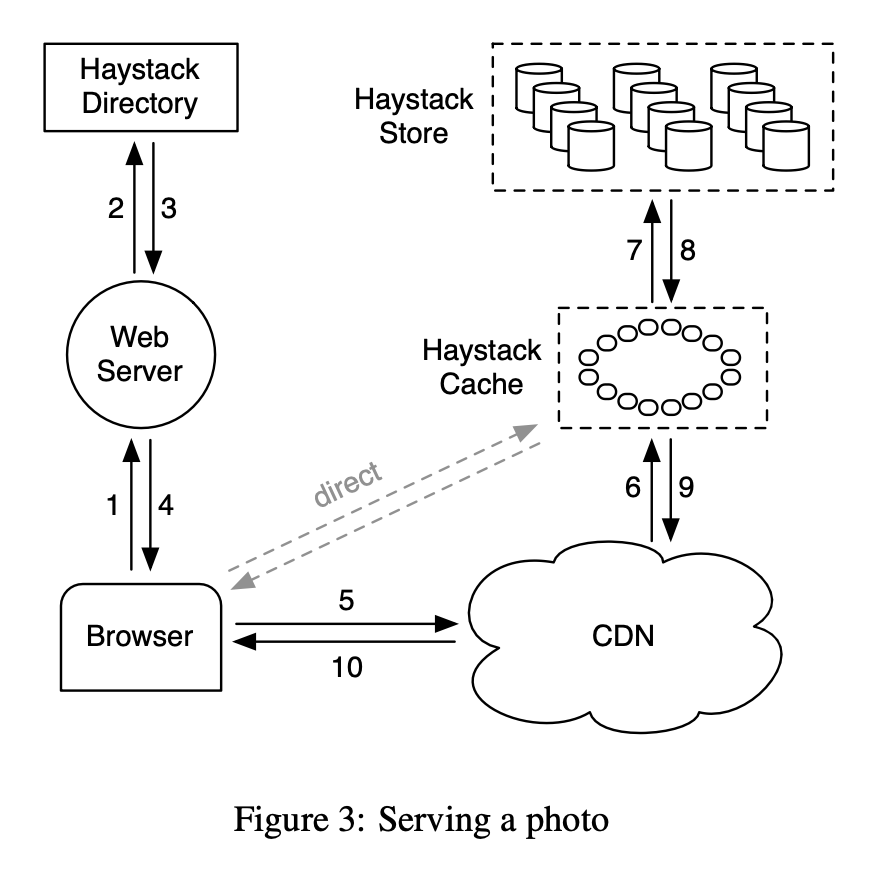

图 3 说明了 Store、Directory 和 Cache 组件如何适应用户浏览器、Web 服务器、CDN 和存储系统之间的典型交互。在 Haystack 架构中，浏览器可以被指示访问 CDN 或 Cache。请注意，虽然 Cache 本质上是CDN，但为了避免混淆，我们使用 “CDN” 来指代外部系统，“Cache” 来指代我们内部缓存图片的系统。拥有一个内部缓存基础设施使我们能够减少对外部 CDN 的依赖。

当用户访问页面时，Web 服务器使用 Directory 来构建每个图片的 URL。该 URL 包含多个信息，每个信息对应于从用户浏览器请求 CDN（或 Cache）到最终从存储器中检索图片的步骤序列。一个指示浏览器访问 CDN 的典型 URL 如下所示：

> http://⟨CDN⟩/⟨Cache⟩/⟨Machine id⟩/⟨Logical volume, Photo⟩

URL 的第一部分指定从哪个 CDN 请求图片。CDN 可以仅使用 URL 的最后一部分（逻辑卷和图片ID）在内部查找图片。如果 CDN 无法定位图片，则它会从 URL 中删除 CDN 地址，并请求 Cache。Cache 进行类似的查找以找到图片，并在未命中时从 URL 中删除 Cache 地址，并从指定的 Store 机器请求图片。直接发送到 Cache 的图片请求具有类似的工作流程，但 URL 缺少特定的 CDN 信息。

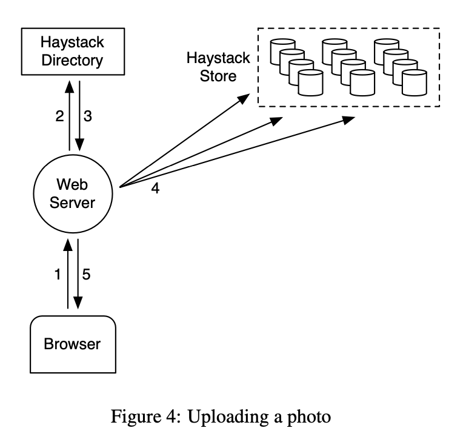

图 4 说明了 Haystack 中的上传路径。当用户上传图片时，首先将数据发送到 Web 服务器。接下来，该服务器从目录中请求一个可写的逻辑卷。最后，Web 服务器为图片分配一个唯一的 ID，并将其上传到映射到分配的逻辑卷的每个物理卷中。

### 3.2 Haystack Directory

Directory 具有四个主要功能。首先，它提供了逻辑卷到物理卷的映射。Web 服务器在上传图片时使用此映射，也在构建页面请求的图片 URL 时使用此映射。其次，Directory 在逻辑卷上进行写负载平衡，物理卷上进行读负载平衡。第三，Directory 确定图片请求应由 CDN 还是 Cache 处理。此功能使我们能够调整对 CDN 的依赖程度。第四，Directory 确定那些逻辑卷是只读的，这可能是由于操作上的原因或由于这些卷已达到其存储容量。为了操作方便，我们以机器为粒度，将卷标记为只读状态。

当我们通过添加新机器来增加 Store 的容量时，这些机器是可写的，只有可写的机器才能接收上传请求。随着时间的推移，这些机器上的可用容量会减少。当一台机器的容量用尽时，我们会将其标记为只读。在下一小节中，我们将讨论这种区别对 Cache 和 Store 的微妙影响。

Directory 是一个相对简单的组件，它将其信息存储在一个有副本的数据库中，通过 PHP 接口访问该数据库，利用 memcache 来降低延迟。如果我们在 Store 上失去了数据，我们会删除相应的映射条目，并在新的 Store 上线时进行替换。

### 3.3 Haystack Cache

Cache 从 CDN 和用户浏览器接收图片的 HTTP 请求。我们将 Cache 组织为分布式哈希表，并使用图片的 ID 作为定位缓存数据的键。如果 Cache 无法立即响应请求，则 Cache 从 URL 中识别的 Store 机器获取图片，并根据需要回复 CDN 或用户的浏览器。

现在，我们强调 Cache 的一个重要方面。仅当满足以下两个条件时，Cache 才会缓存图片：（a）请求直接来自用户而不是 CDN，（b）图片从可写的 Store 机器中提取。第一个条件的理由是，我们使用基于 NFS 的设计经验表明，post-CDN 缓存是无效的，因为在 CDN 中未命中的请求不太可能在我们的内部缓存中命中。第二个条件的推理是间接的。我们使用 Cache 来保护可写的 Store 机器免受读取，因为有两个有趣的属性：图片在上传后不久会被大量访问，并且我们的文件系统通常在执行读取或写入时表现更好，而不是同时进行读写（请参见第 4.1 节）。因此，如果没有 Cache，可写的 Store 机器将看到最多的读取。鉴于这一特点，我们计划实现的一种优化是在我们预计这些图片很快经常被读取时，主动将最近上传的图片推入 Cache 中。

### 3.4 Haystack Store

Store 机器接口意图保持简单。读取操作会提出非常具体的请求，该接口请求以指定的图片 ID、逻辑卷 ID 和特定的 Store 机器为参数，用于获取对应的图片。如果找到该图片，机器将返回该图片。否则，机器将返回一个错误。

每个 Store 机器管理多个物理卷。每个卷可容纳数百万张图片。为了方便起见，读者可以将物理卷视为一个非常大的文件（100 GB），保存为 “/hay/haystack_\<logical volume id\>”。Store 机器可仅使用相应逻辑卷的 ID 和图片所在的文件偏移量快速访问图片。这是 Haystack 设计的关键：在不需要磁盘操作的情况下检索特定图片的文件名、偏移量和大小。Store 机器为其管理的每个物理卷保持打开的文件描述符，并且还保留一个内存映射，将图片 ID 映射到文件系统元数据（即文件名、偏移量和字节数），这些元数据对于检索该图片至关重要。

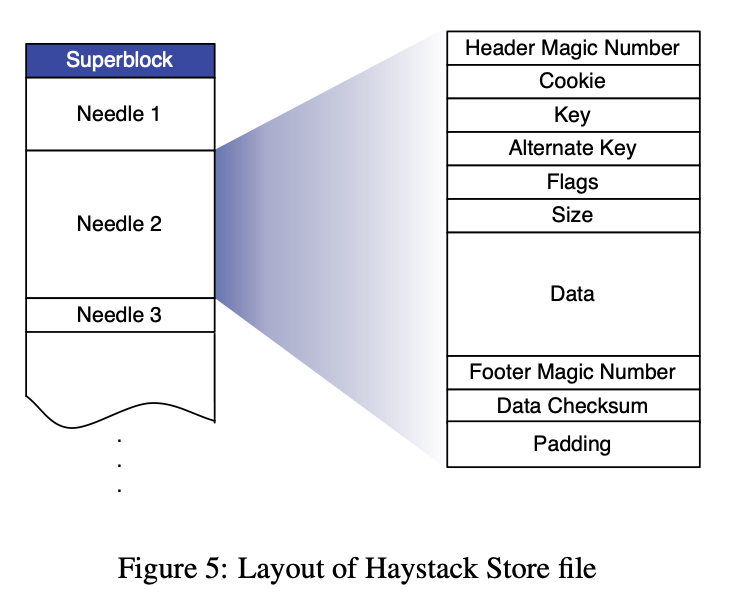

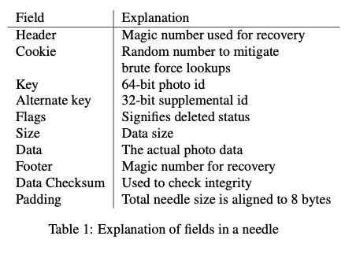

现在我们描述每个物理卷的布局以及如何从该卷派生内存映射。Store 机器将物理卷表示为由 **SuperBlock** 和一系列 **Needle** 组成的大文件。每个 Needle 代表存储在 Haystack 中的一张图片。图 5 展示了一个卷文件以及每个 Needle 的格式。表 1 描述了每个 Needle 中的字段。

为了快速检索 Needle，每个 Store 机器为每个卷维护一个内存数据结构。该数据结构将 (key, alternate key) 元组映射到相应 Needle 的 flags、size 和卷 offset。在崩溃后，Store 机器可以直接从卷文件中重构此映射，然后处理请求。现在，我们描述 Store 机器在响应读、写和删除请求时如何维护其卷和内存映射（这是 Store 支持的唯一操作）。

#### 3.4.1 读取图片

当 Cache 机器请求一张图片时，它会向 Store 机器提供逻辑卷 ID、key、alternate key 和 cookie。cookie 是嵌入在图片 URL 中的一个数字。cookie 的值是在图片上传时由 Directory 随机分配并存储的。cookie 有效地消除了试图猜测图片有效 URL 的攻击。

当 Store 机器接收到 Cache 机器接的图片请求时，它会在其内存映射中查找相关元数据。如果图片未被删除，则 Store 机器会定位到卷文件中的适当偏移量，从磁盘中读取整个 Needle（其大小可以提前计算），并验证cookie 和数据的完整性。如果这些检查通过，则 Store 机器将图片返回给 Cache 机器。

#### 3.4.2 写入图片

当将图片上传到 Haystack 时，Web 服务器会向 Store 机器提供逻辑卷 ID、key、alternate key、cookie 和数据。每个机器同步将 Needle 图片追加到其物理卷文件中，并根据需要更新内存映射。虽然简单，这种仅追加的限制却增加了一些修改图片的操作的复杂性，如旋转。由于 Haystack 禁止重写 Needle，因此只能通过添加具有相同 key 和 alternate key 的更新 Needle 来修改图片。如果新的 Needle 被写入与原始针头不同的逻辑卷中，则 Directory 将更新其应用程序元数据，并且未来的请求将永远不会获取旧版本。如果新的 Needle 被写入相同的逻辑卷中，则 Store 机器将新的 Needle 追加到相应的物理卷中。Haystack 根据 Needle 的偏移量区分这些重复的 Needle。也就是说，在物理卷中，最新版本的 Needle 是偏移量最高的那个版本。

#### 3.4.3 删除图片

删除图片很简单。Store 机器将删除标记设置在内存映射和卷文件中，然后进行同步。获取已删除的图片的请求首先检查内存标记，如果该标记被启用，则返回错误。请注意，被删除 Needle 占用的空间暂时会丢失。稍后，我们将讨论如何通过压缩卷文件来回收删除的 Needle 空间。

#### 3.4.3 索引文件

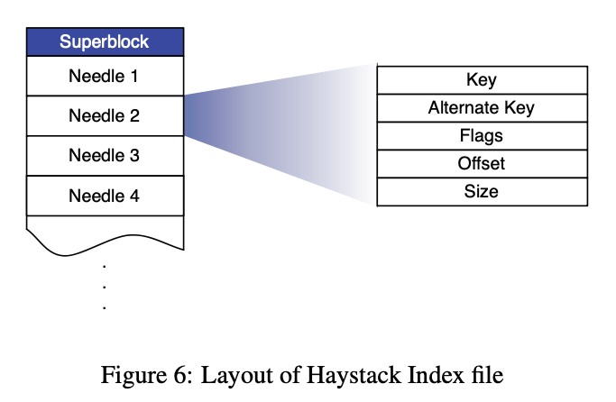

当重新启动时，Store 机器使用一个重要的优化——索引文件。理论上，一台机器可以通过读取其所有物理卷来重构其内存映射，但这样做很耗时，因为要从磁盘中读取大量数据（约数万亿字节）。索引文件允许 Store 机器快速构建其内存映射，缩短重新启动时间。

Store 机器为其每个卷维护一个索引文件。索引文件是用于在磁盘上高效定位 Needle 的内存数据结构的 checkpoint。索引文件的布局类似于卷文件，包含 SuperBlock，后跟一系列索引记录，每个记录对应于 SuperBlock 中的每个 Needle。这些记录必须按照相应的 Needle 在卷文件中的顺序出现。图 6 展示了索引文件的布局，表 2 解释了每个记录中的不同字段。

使用索引重新启动比仅读取索引并初始化内存映射要稍微复杂一些。之所以复杂是因为索引文件是异步更新的，这意味着索引文件可能代表陈旧的 checkpoint。当我们写入新图片时，Store 机器会同步将 Needle 追加到卷文件的末尾，并异步将记录追加到索引文件中。当我们删除图片时，Store 机器会同步设置该图片所在 Needle 的标记，但不会更新索引文件。这些设计决策可以使写入和删除操作更快地返回，因为它们避免了额外的同步磁盘写入。但它们也会引起两个副作用，我们必须解决：(1). Needle 可以没有相应的索引记录。(2). 索引记录不反映已删除的图片。

我们将没有相应索引记录的 Needle 称为*孤儿*。在重启期间，Store 机器顺序检查每个孤儿，创建一个匹配的索引记录，并将该记录追加到索引文件中。需要注意的是，我们可以快速识别孤儿，因为索引文件中的最后一条记录对应于卷文件中的最后一个非孤儿 Needle。为了完成重启，Store 机器现在只使用索引文件初始化其内存映射。

由于索引记录不反映已删除的图片，Store 机器可能会检索实际上已被删除的图片。为解决这个问题，当 Store 机器读取一张图片的完整 Needle 后，该机器可以检查删除标记。如果一个 Needle 被标记为已删除，则 Store 机器相应地更新其内存映射，并通知 Cache 未找到该对象。

#### 3.4.5 文件系统

我们将 Haystack 描述为一种利用通用的类 Unix 文件系统的对象存储，但有些文件系统更适合 于Haystack。特别是，Store 机器应该使用一种文件系统，它不需要太多的内存就能够快速地在大文件中执行随机查找。目前，每个 Store 机器使用基于范围的文件系统 XFS [24]。XFS 对 Haystack 有两个主要优点。首先，几个相邻的大文件的块映射可以足够小，以便存储在主内存中。其次，XFS 提供高效的文件预分配，减少了碎片化并限制了块映射的增长。

使用 XFS，Haystack 可以消除在读取图片时检索文件系统元数据的磁盘操作。然而，这个好处并不意味着 Haystack 可以保证每次读取图片都只会产生一个磁盘操作。存在一些极端情况，当图片数据跨越范围或 RAID 边界时，文件系统需要多个磁盘操作。Haystack 预分配 1GB 的范围，并使用256KB 的 RAID 条带大小，因此在实践中我们很少遇到这些情况。

### 3.5 故障恢复

与许多在通用硬件上运行的大规模系统 [5、4、9] 一样，Haystack 需要容忍各种故障：硬盘故障、RAID 控制器故障、主板故障等。我们使用两种简单的技术来容忍故障，一种用于检测，另一种用于修复。

为了主动发现出问题的 Store 机器，我们维护一个名为 *pitch-fork* 的后台任务，定期检查每个 Store 机器的健康状况。Pitchfork 远程测试每个 Store 机器的连接，检查每个卷文件的可用性，并尝试从 Store 机器读取数据。如果 pitchfork 确定一个 Store 机器一直无法通过这些健康检查，那么它会自动将驻留在该 Store 机器上的所有逻辑卷标记为只读。我们会离线手动解决失败检查的根本原因。

一旦诊断出问题，我们可能快速修复问题。但有时我们需要进行更多的 *bulk sync* 操作，在这种情况下，我们使用副本提供的卷文件重置 Store 机器的数据。*Bulk sync* 操作很少发生（每个月只有几次），虽然简单但执行速度较慢。主要瓶颈是要进行批量同步的数据量通常比每个 Store 机器的 NIC 速度高几个数量级，导致需要几个小时的平均恢复时间。我们正在积极探索解决这个限制。

### 3.6 优化

现在我们讨论几个对 Haystack 成功至关重要的优化。

#### 3.6.1 压缩

压缩是一种在线操作，用于回收已删除和重复的 Needle（具有相同 key 和 alternate key 的 Needle）。Store 机器通过将 Needle 复制到新文件中来压缩卷文件，同时跳过任何重复或已删除的条目。在压缩过程中，删除操作会同时应用到两个文件中。一旦该过程到达文件末尾，它将阻止对该卷的进一步修改，并原子地交换文件和内存结构。

我们使用压缩来释放已删除的图片所占用的空间。删除操作的模式与图片查看的模式类似：较新的图片更有可能被删除。在一年的时间里，大约有25%的图片被删除。

#### 3.6.2 节约更多内存

如上所述，Store 机器维护一个包括 flags 在内的内存数据结构，但我们当前的系统只使用 flags 来标记已删除的针。我们通过将已删除图片的偏移量设置为 0 来消除了需要内存中表示 flags 的需要。此外，Store 机器不会在主内存中跟踪 cookie 值，而是在从磁盘读取 Needle 之后检查提供的 cookie。通过这两种技术，Store 机器将其主内存占用量减少了20%。

目前，Haystack 平均每张图片使用 10 个字节的主内存。回想一下，我们将每个上传的图片缩放为四张带有相同 key（64位）、不同 alternate key（32位）、不同数据大小（16位）的图片。除了这 32 字节之外，Haystack 由于哈希表等开销占用了大约每个图片 2 个字节，使得相同图片的四张缩放图片的总计内存占用为 40 个字节。相比之下，Linux 中的 `xfs_inode_t` 结构占用536个字节。

#### 3.6.3 批量上传

由于磁盘通常更擅长执行大块的顺序写入而不是小的随机写入，因此我们尽可能地批量上传图片。幸运的是，许多用户将整个相册上传到 Facebook，而不是单个图片，为将相册中的图片进行批量处理提供了明显的机会。在第4节中，我们定量评估了将写操作聚合在一起的改进效果。

## 4 评估

我们将评估分为四个部分。第一部分是我们对 Facebook 所见图片请求的特征进行的描述。第二部分和第三部分分别展示了 Directory 和 Cache 的有效性。最后，我们使用人造的和生产的工作负载分析 Store 的性能表现。

### 4.1 表征图片请求

图片是用户在 Facebook 上分享的主要内容之一。用户每天上传数百万张图片，最近上传的图片往往老旧的图片更受欢迎。图 7 说明了每张图片随着其上传时间变化而变得多受欢迎。为了理解图形的形状，有必要讨论一下是什么驱动了 Facebook 图片请求。

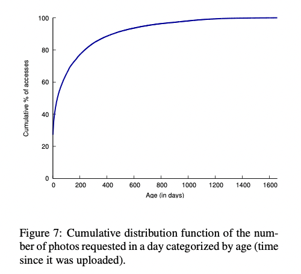

#### 4.1.1 驱动图片请求的因素

有两个功能负责了Facebook 98% 的图片请求：新闻动态和相册。新闻动态功能向用户展示他们的好友最近分享的内容。相册功能允许用户浏览她的好友的图片。她可以查看最近上传的图片，也可以浏览所有单独的相册。

图 7 显示了对几天前的图片的请求数量急剧增加。新闻动态驱动了大部分近期图片的流量，并在大约 2 天左右急剧下降，因为许多故事停止在默认的 Feed 视图中显示。从图中可以突出两个关键点。首先，快速下降的流行度表明，在 CDN 和 Cache 中进行缓存可以非常有效地托管流行的内容。其次，该图形具有一个长尾，暗示了大量请求不能通过缓存数据处理。

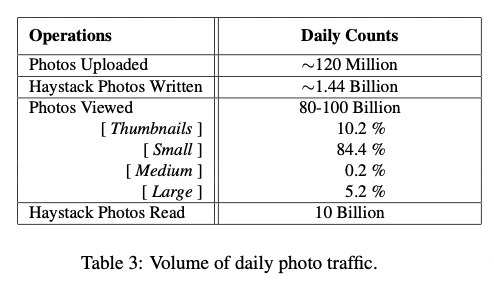

#### 4.1.2 卷流量

表 3 显示了 Facebook 上的图片流量。由于我们的应用程序将每个图片缩放为 4 种大小，并将每种大小保存在 3 个不同的位置中，因此 Haystack 写入的图片数量是上传的图片数量的 12 倍。该表显示，Haystack 响应了 CDN 中大约 10% 的所有图片请求。注意，大部分查看的图片都比较小。这个特点强调了我们希望尽量减少元数据开销，因为效率低下可能会快速累积。此外，对于 Facebook 来说，读取较小的图片通常是对延迟更敏感的操作，因为它们显示在新闻动态中，而较大的图片则显示在相册中，并且可以进行预取以隐藏延迟。

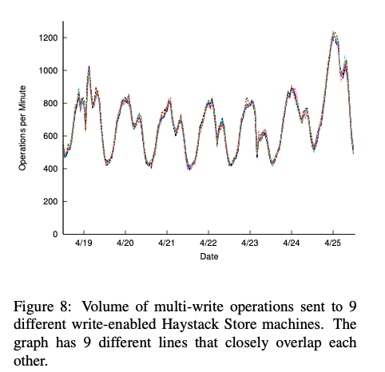

### 4.2 Haystack Directory

Haystack Directory 平衡了对 Haystack Store 机器的读写操作。图 8 显示，预期中，Directory 的简单哈希策略用于分配读写操作非常有效。该图显示了 9 台部署到生产环境的不同 Store 机器所看到的 multi-write 操作的数量。这些 Store 存储不同的图片集。由于线条几乎无法区分，我们得出结论，Directory 很好地平衡了写操作。将 Store 机器之间的读取流量进行比较，也表现出了类似良好的行为。

### 4.3 Haystack Cache

图 9 显示了 Haystack Cache 的命中率。回想一下，如果一个图片被保存在一个启用写入的 Store 机器上，Cache 才会存储它。这些图片相对较新，这解释了命中率高达80%左右。由于启用写入的 Store 机器也将看到最大数量的读取，Cache 在显著减少最受影响的机器的读取请求速率方面非常有效。

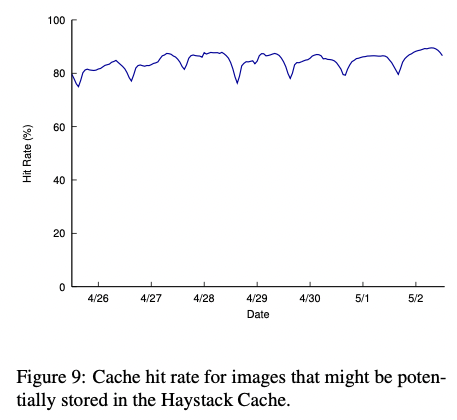

### 4.3 Haystack Store

回想一下，Haystack 的目标是解决针对图片请求的长尾，并旨在在看似随机的读取时保持高吞吐量和低延迟。我们提供了 Store 机器在人造的和生产的工作负载下的性能结果。

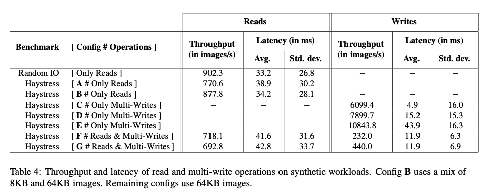