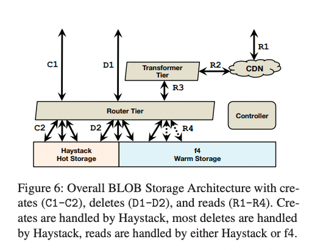
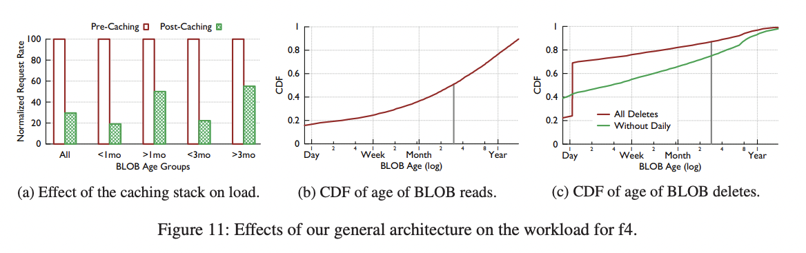

# f4: Facebook’s Warm BLOB Storage System

## 概述

Facebook 的照片、视频和其他大型二进制对象（BLOBs）的语料库需要可靠存储和快速访问，其规模庞大且不断增长。随着BLOBs 的占用空间增加，将它们存储在我们传统的存储系统 Haystack 中变得越来越低效。为了提高存储效率（以 BLOBs 的有效复制因子衡量），我们研究 BLOBs 的底层访问模式，并确定包含经常访问的热 BLOBs 和较少访问的温 BLOBs 的温度区域。我们的整体 BLOB 存储系统旨在隔离温 BLOBs，并使我们能够使用专门的温 BLOB 存储系统 f4。f4 是一个新系统，可以降低温 BLOBs 的有效复制因子，同时保持容错性，并满足较低的吞吐量需求。

f4 目前存储了超过 65PB 的逻辑 BLOBs，并将它们的有效复制因子从 3.6 降低到 2.8 或 2.1。f4 提供低延迟，对磁盘、主机、机架和数据中心故障具有弹性，并为温 BLOBs 提供足够的吞吐量。

## 1. 介绍

随着 Facebook 的发展和每个用户分享的数据量增加，高效存储数据变得越来越重要。Facebook 存储的重要数据类型之一是Binary Large OBjects（BLOBs），它们是不可变的二进制数据。BLOBs 仅创建一次，被多次读取，从不被修改，有时会被删除。Facebook 的 BLOB 类型包括照片、视频、文档、跟踪数据、堆转储和源代码。BLOBs 的存储占用空间很大。截至 2014 年 2 月，Facebook 存储了超过 4,000 亿张照片。

Haystack [5] 是 Facebook 最初的 BLOB 存储系统，已经投入使用超过七年，专为 IO 密集型工作负载设计。它几乎总是通过一次磁盘寻址即可读取 BLOB，并通过三副本实现容错性和支持高请求率。然而，随着 Facebook 的发展和演变，BLOB 存储工作负载也发生了变化。存储的 BLOB 类型增加了。大小和创建、读取和删除速率的多样性也增加了。最重要的是，现在存在大量且不断增加的请求率低的 BLOBs。对于这些 BLOBs，从吞吐量角度来看，三副本机制存在过度供应。然而，三副本也提供了重要的容错性保证。

我们最新的 f4 BLOB 存储系统提供与 Haystack 相同的容错性保证，但有效复制因子较低。f4 是一个简单、模块化、可扩展和容错的系统；它处理我们存储的 BLOBs 的请求率；以足够低的延迟响应请求；对磁盘、主机、机架和数据中心故障具有容错性；而且它以低的有效复制因子提供所有这些功能。

我们将 f4 描述为一个温 BLOB 存储系统，因为其内容的请求率低于 Haystack 中的内容，因此不怎么“热”。与可靠存储数据但可能需要数天或数小时才能检索数据的冷存储系统（[20, 40]）相比，温存储形成鲜明对比，这对于面向用户的请求来说是无法接受的长时间。我们还使用温度来描述 BLOBs，其中热 BLOBs 接收到许多请求，而温 BLOBs 接收到较少请求。

我们将展示 BLOB 的年龄与其温度之间存在着很强的相关性。新创建的 BLOBs 的请求率远高于老旧的 BLOBs。例如，对于九种类型中的八种类型，一周内的 BLOBs 的请求率比一天内的内容低一个数量级。此外，年龄与删除率之间存在着很强的相关性。我们利用这些发现来指导我们的设计：温 BLOBs 的较低请求率使我们能够为 f4 提供比 Haystack 更低的最大吞吐量，并且温 BLOBs 的低删除率使我们能够简化 f4，无需在删除后迅速回收空间。我们还利用我们的发现，通过年龄和温度之间的相关性来识别温内容。

Facebook 的整体 BLOB 存储架构旨在实现温存储。它包括一个缓存堆栈，显著减轻存储系统的负载，并使其能够为每个 BLOB 提供较少的请求；一个处理计算密集型 BLOB 转换并可以独立于存储进行扩展的转换层；一个抽象底层存储系统并实现它们之间无缝迁移的路由层；以及热存储系统 Haystack，它将新创建的 BLOBs 聚合到卷中，并将它们存储起来，直到它们的请求和删除率降低到足够低的程度，可以迁移到 f4 中。

f4 使用分布式纠删码在单元格中存储温 BLOBs 的卷，其使用的物理字节比三副本更少。它使用 Reed-Solomon (10,4)编码，并将块布置在不同的机架上，以确保在单个数据中心内对磁盘、机器和机架故障具有弹性。它在广域网中使用 XOR 编码，以确保对数据中心故障具有弹性。f4 在 Facebook 的生产环境中运行了超过 19 个月。f4 当前存储超过 65PB 的逻辑数据，并节省了超过 53PB 的存储空间。

本文的贡献包括：

- 使用温存储的案例为未来研究提供指导，并证明了我们的努力是合理的。
- 我们整体 BLOB 存储架构的设计，使其能够实现温存储。
- f4 的设计，这是一个简单、高效且容错的温存储解决方案，将我们的有效复制因子从 3.6 降低到 2.8，然后降低到 2.1。
- 对 f4 的生产评估。

该论文继续在第 2 节介绍背景知识。第 3 节介绍温存储的案例。第 4 节介绍我们整体 BLOB 存储架构的设计，使其能够实现温存储。第 5 节介绍了 f4 的设计。第 6 节涵盖了对 f4 的生产评估。第 7 节介绍了我们所学到的经验教训。第 8 节涵盖了相关工作。第 9 节对论文进行了总结。

## 2. 背景

本节阐述了 BLOB 存储在 Facebook 完整架构中所在的位置。它还描述了我们存储的不同类型的 BLOB 以及它们的大小分布。

### 2.1 BLOB 存储的位置

 图 1 展示了 BLOB 存储在 Facebook 整体架构中的位置。BLOB 的创建，例如视频上传，起源于 Web层（C1）。Web 层将数据写入 BLOB 存储系统（C2），然后将该数据的句柄存储到我们的图存储系统 Tao（C3）中。该句柄可用于检索或删除 BLOB。Tao 将句柄与图的其他元素关联起来，例如视频的所有者。

BLOB 的读取，例如观看视频，也起源于 Web 层（R1）。Web 层访问图存储（R2）以查找所需的句柄，并构建一个可用于获取 BLOB 的 URL。当浏览器稍后发送对 BLOB 的请求（R3）时，请求首先发送到内容分发网络（CDN）[2, 34]，该网络缓存常用的 BLOB。如果 CDN 没有所请求的 BLOB，它会向 BLOB 存储系统发送请求（R4），缓存 BLOB，并将其返回给用户。CDN 屏蔽了对频繁访问的数据的大量请求，这在第 4.1 节中我们将进一步讨论其重要性。

### 2.2 BLOBs 的含义

BLOB（Binary Large Objects）是不可变的二进制数据。它们只能被创建一次，但可以被多次读取，而且只能被删除，而不能修改。这涵盖了 Facebook 上许多类型的内容。大多数 BLOB 类型是面向用户的，例如照片、视频和文档。其他 BLOB 类型是内部使用的，例如跟踪数据、堆转储和源代码。面向用户的 BLOB 更为常见，因此在本文的剩余部分我们将重点关注它们，并简单称之为 BLOB。

图 2 显示了五种 BLOB 类型的大小分布情况。BLOB 的大小具有相当大的多样性，这对我们的设计有一定的影响，如第 5.6 节所讨论的。

## 3. 温存储的案例

本节旨在为 Facebook 的温存储系统的创建提供动机。它证明了数据存在温度区域，年龄是温度的良好代理，并且温数据量庞大且不断增长。

**方法论**：本节所呈现的数据源自以下几个方法：两周的追踪、现有系统的基准测试以及每日摘要统计的快照。追踪包括随机选择的 0.1% 读取操作、10% 创建操作和 10% 删除操作。

数据是针对九种用户常见的 BLOB 类型进行呈现的。由于日志信息不完整，我们在某些分析中排除了某些数据类型。

这九种 BLOB 类型包括个人照片、照片、高清照片、移动同步照片 [17]、高清移动同步照片、群组附件 [16]、视频、高清视频和消息（聊天）附件。群组附件和消息附件对于我们的存储系统来说是不透明的 BLOB，它们可以是文本、PDF、演示文稿等各种形式。

**温度区域的存在**：为了证明温存储的必要性，我们首先展示温度区域的存在，即内容开始时处于热门状态，接收大量请求，随着时间的推移逐渐降温，接收的请求越来越少。图 3 显示了给定年龄内容的相对请求率，即每个对象每小时的请求数量。该图表是使用两周追踪中的 0.1% 的读取操作数据生成的。记录了每个被读取对象的年龄，并将其分成 1 天的间隔。然后，统计追踪中每个小时对每日桶的请求数量，并报告平均值，中位数也类似但更加嘈杂。为了提高可读性，绝对值被反归一化处理，因此每条曲线相对于自身而言。数据点标记了数量级的降低。

从随时间减少的请求率趋势中可以清楚地看出温度区域的存在。对于所有九种类型的内容，不到一天的内容的请求率超过一年的内容的 100 倍。对于八种类型的内容，请求率在不到一周的时间内下降了一个数量级，对于六种类型的内容，请求率在不到 60 天的时间内下降了 100 倍。

**区分温度区域**：鉴于温度区域的存在，下一个需要回答的问题是如何区分热存储和温存储的内容，以及何时将内容移至温存储是安全的。我们定义温度区域为包括请求率较低且内容不变的内容。由于 BLOBs 不会被修改，因此唯一的更改是删除操作。因此，区分温存储和热存储的内容取决于请求率和删除率。

首先，我们检查请求率。为了确定热存储和温存储之间的界限，我们考虑了接近最坏情况下的请求率，因为我们的内部服务级别对象在一天中最繁忙的时段要求接近最坏情况的低延迟。

图 4 显示了按年龄分组的各种类型的 BLOB 的第 99 百分位数或接近最坏情况下的请求负载。该图表是使用两周追踪中 0.1% 的读取操作数据生成的。记录了每个被读取对象的年龄，并将其分成与创建 1TB 该类型 BLOB 所需时间相等的间隔。例如，如果某种类型的 BLOB 每 3600 秒创建 1TB，那么第一个桶包含 0-3599 秒的对象，第二个桶包含 3600-7200 秒的对象，依此类推。然后，我们通过查看 1000 秒的窗口来补偿 0.1% 的采样率。我们报告这些窗口的第 99 百分位数请求率，即在我们的两周追踪中，对于每个年龄段的 1000 秒窗口内的请求数量，我们报告第 99 百分位数的请求数量。f4 使用的 4TB 磁盘可以在保持每个请求延迟可接受的情况下，提供最大 80 次每秒的输入/输出操作（IOPS）。该图显示了这种峰值温存储吞吐量，即每 TB 的 IOPS 为 20。

根据图 4 所示的接近最坏情况下的请求率，有七种类型的 BLOB 在不到一周的时间内的接近最坏情况吞吐量都低于温存储系统的容量。对于照片（Photos），大约需要 3 个月才能降低到低于温存储容量的水平，而对于个人资料照片（Profile Photos），则需要一年的时间。

我们还对 BLOB 类型的删除率进行了分析，尽管没有进行严格的定量分析。总体趋势是，大多数删除操作针对的是年轻的 BLOB，并且一旦某个 BLOB 的请求率降低到低于温存储的阈值，删除率也很低。

将删除分析与请求率分析结合起来，可以确定一个月的年龄作为划分热存储和温存储内容的安全分界线，适用于除两种 BLOB 类型之外的所有情况。其中一种类型，个人资料照片（Profile Photos）不会被移至温存储。另一种类型，照片（Photos）使用了三个月的阈值。

**温存储是大规模且不断增长的**：我们通过展示温存储所占比例的大小来进一步证明温存储的必要性。图 5 显示了六种 BLOB 类型在三个月间隔内的温存储比例。

我们使用前面的分析来确定每种类型的温存储截止点，即大多数类型为一个月。该图表报告了每种类型在过去 9-6 个月、6-3 个月和最近 3 个月至今的三个月间隔内的温存储比例的中位数。图表显示，温存储内容占所有对象的比例很大：在最早的间隔中，对于所有类型的对象，超过 80% 的对象属于温存储。图表还显示温存储比例正在增加：在最近的间隔中，对于所有类型的对象，超过 89% 的对象属于温存储。

本节展示了温度区域的存在，Facebook 现有类型的热存储和温存储之间的界限可以安全地设定为一个月，并且温存储内容占整体 BLOB 内容的比例很大且不断增长。接下来，我们将描述 Facebook 的整体 BLOB 存储架构如何支持温存储。

## 4. BLOB 存储设计

我们的 BLOB 存储设计遵循简单、专注和与其任务相匹配的原则。在本节中，我们将解释存储卷的概念，描述我们 BLOB 存储系统的完整设计，并说明它如何通过 f4 实现专注和简单的温存储。

**存储卷**：我们将 BLOB 聚合到逻辑卷中。卷会聚集文件系统的元数据，从而使我们的存储系统在 IOPS（每秒输入/输出操作数）方面减少浪费，接下来我们将进一步讨论这一点。我们将逻辑卷分为两类。初始状态下，卷是解锁的，支持读取、创建（追加）和删除操作。一旦卷满了，大约达到 100GB 的大小，它们就会转为锁定状态，不再允许创建操作。锁定的卷只允许读取和删除操作。

每个卷由三个文件组成：数据文件、索引文件和日志文件。数据文件和索引文件与 Haystack 的公开版本 [5] 相同，而日志文件是新加入的。数据文件存储每个 BLOB 以及关联的元数据，例如键、大小和校验和。索引文件是存储机器内存查找结构的快照。其主要目的是使重启的机器能够快速重建其内存索引。日志文件跟踪已删除的 BLOB；与 Haystack 的原始版本不同，删除操作是通过直接更新数据和索引文件来处理的。对于锁定的卷，数据文件和索引文件是只读的，而日志文件是可读写的。对于解锁的卷，三个文件都是可读写的。

### 4.1 整体的存储系统

完整的BLOB存储架构如图6所示。

创建操作进入系统时通过路由器层（C1），并被定向到热存储系统中的适当主机（C2）。删除操作通过路由器层（D1）进入系统，并被定向到适当存储系统中的适当主机（D2）。读取操作通过缓存堆栈（R1）进入系统，如果在那里无法满足，则经过转换器层（R2）到达路由器层（R3），后者将其定向到适当存储系统中的适当主机（R4）。

**Controller**：控制器确保整个系统的平稳运行。它负责新建存储机器、维护未锁卷的资源池，确保所有逻辑卷有足够的物理卷支持，必要时创建新的物理卷，并执行定期的维护任务，如压缩和垃圾回收。

**Router Tier**：路由器层是 BLOB 存储的接口，它隐藏了存储的具体实现，并允许添加新的子系统，如 f4。它的客户端，即 Web 层或缓存堆栈，将逻辑 BLOB 的操作发送给它。

路由器层的机器是相同的，它们执行相同的逻辑，并且都具有逻辑卷到物理卷映射的软状态副本，该映射通常存储在单独的数据库中（未显示）。路由器层通过添加更多机器来扩展，并且其规模与整个系统的其他部分独立。

对于读取操作，路由器从 BLOB ID 中提取逻辑卷 ID，并查找该卷的物理映射。它选择可用的物理卷（通常是最近的机器上的卷），并将请求发送给它。如果发生故障，将触发超时，请求将被转发到下一个物理卷。

对于创建操作，路由器选择具有可用空间的逻辑卷，并将BLOB发送到该逻辑卷的所有物理卷。如果出现任何错误，将忽略任何部分写入的数据以便稍后进行垃圾回收，并选择新的逻辑卷进行创建。

对于删除操作，路由器向BLOB的所有物理副本发出删除命令。响应是异步处理的，如果失败，删除操作将不断重试，直到BLOB完全被删除。

路由器层通过将存储实现隐藏在客户端之后，实现了热存储。当一个卷从热存储系统迁移到温存储系统时，它在更新规范映射后暂时驻留在两个系统中，然后客户端操作会自动定向到新的存储系统。

**Transformer Tier**：转换器层对检索到的BLOB执行一系列转换操作，例如调整大小和裁剪照片。在Facebook的旧系统中，这些计算密集型的转换操作是在存储机器上执行的。

转换器层通过将计算分离到自己的层级中，使存储系统专注于提供存储。将计算分离到独立的层级中允许我们独立扩展存储层和转换器层。这样，我们可以精确地匹配存储层的大小与我们的需求。此外，它使我们能够为每个任务选择更优化的硬件。特别是，存储节点可以设计成只有一个CPU和相对较少的RAM，但能够容纳大量的磁盘。

**Caching Stack**：BLOB 的读取操作最初被定向到缓存堆栈\[2, 34\]，如果一个BLOB位于其中一个缓存中，则直接返回，避免了对存储系统的读取。这样可以吸收对热门BLOB的读取，并降低对存储系统的请求率。

缓存堆栈通过降低其请求率实现了温存储。

**Haystack 的热存储系统**：Facebook 的热存储系统 Haystack 旨在充分利用 IOPS（每秒I/O操作数）。它通过处理所有的 BLOB 创建操作、大部分删除操作和更高的读取速率来实现温存储。

Haystack 旨在充分利用磁盘 IOPS，具体包括以下设计：

- **BLOB 分组**：Haystack只创建少量（约100个）文件，其中BLOB按顺序排列在这些文件中。结果是一个简单的BLOB存储系统，使用少量文件，并且大部分元数据访问不涉及底层文件系统。
- **紧凑的元数据管理**：Haystack识别出定位每个BLOB所需的最小元数据集，并将这些元数据精心布局，以适应机器上可用的内存。这样可以尽量减少用于元数据获取的IOPS浪费。

BLOB 被分组成逻辑卷。为了容错和性能，每个逻辑卷映射到多个物理卷或在不同地理区域的不同主机上的副本：每个逻辑卷的所有物理卷存储相同的一组 BLOB。每个物理卷完全位于一个 Haystack 主机上。通常，每个逻辑卷有 3 个物理卷。每个卷可容纳数百万个不可变的 BLOB，并且可以增长到约 100GB 的大小。

当主机接收到读取请求时，它在内存中的哈希表中查找相关的元数据（数据文件中的偏移量、数据记录的大小以及是否已删除），然后执行单个 I/O 请求来读取整个数据记录。

当主机接收到创建请求时，它会同步将记录追加到其物理卷中，更新内存中的哈希表，并同步更新索引和日志文件。

当主机接收到删除请求时，它会更新内存中的哈希表和日志文件。BLOB 的内容仍然存在于数据文件中。定期地，我们会对卷进行压缩，完全删除 BLOB 并回收其空间。

**容错性**：Haystack具有对磁盘、主机、机架和数据中心故障的容错能力，通过数据文件的三重复制和硬件 RAID-6（1.2 倍复制）实现。

每个卷的两个副本位于主数据中心的不同机架、主机和磁盘上。这提供了对磁盘、主机和机架故障的弹性。 RAID-6 提供了对磁盘故障的额外保护。第三个副本位于另一个数据中心，并提供对数据中心故障的弹性。

这种方案为 BLOB 提供了良好的容错性和高吞吐量，但有效复制因子为 3 * 1.2 = 3.6。这是 Haystack 的主要限制：它针对 IOPS 进行了优化，但不考虑存储效率。正如温存储的案例所表明的那样，这导致许多 BLOB 的过度复制。

**过期驱动的内容（Expiry-Driven Content）**：某些 BLOB 类型的内容具有过期时间。例如，上传的视频在进行转码到我们的存储格式时会暂时保留在其原始格式中。我们避免将这些有过期驱动的内容移动到 f4，并将其保留在 Haystack 中。热存储系统通过频繁运行压缩来应对高删除率，以回收现在可用的空间。

## 5. f4 设计

本节描述了我们对温存储的设计目标，然后介绍了 f4，我们的温存储系统。

### 5.1 设计目标

在高层次上，我们希望我们的温存储系统具备存储效率，并提供容错性，以便我们不会丢失数据或对用户不可用。

**存储效率**：我们新系统的一个关键目标是提高存储效率，即减少有效复制因子，同时仍保持高度的可靠性和性能。

有效复制因子描述了实际物理数据大小与存储的逻辑大小之间的比例关系。在一个维护 3 个副本的系统中，并在每个节点上使用 12 个磁盘的 RAID-6 编码，有效复制因子为 3.6。

**容错性**：我们存储系统的另一个重要目标是对故障层次的容错性，以确保我们不会丢失数据，并且存储始终可用于客户请求。我们明确考虑了四种类型的故障：

1. 磁盘故障，以年度低于个位数的频率发生。
2. 主机故障，定期发生。
3. 机架故障，每年发生多次。
4. 数据中心故障，极其罕见且通常是暂时性的，但可能具有更严重的灾难性影响。

### 5.2 f4 概述

f4 是我们用于温数据的存储子系统。它由多个单元格组成，其中每个单元格完全位于一个数据中心内，并由同类硬件组成。目前的单元格使用 14 个机架，每个机架有 15 个主机，每个主机有 30 个 4TB 的磁盘。我们将一个单元格视为获取和部署的单位，并进行推出和扩展。

一个单元格负责可靠地存储一组锁定的卷，并使用`Reed-Solomon`编码以较低的存储开销存储这些卷。分布式纠删码可以以较低的存储开销实现可靠性，而不是通过复制，但在故障和恢复时需要更长的重建和恢复时间，并且最大读吞吐量较低。`Reed-Solomon`编码是最流行的纠删码技术之一，并已在许多不同的系统中使用。`Reed-Solomon(n,k)`编码用 **k** 个附加比特对 **n** 比特的数据进行编码，可以容忍 **k** 个故障，总体存储大小为 `n + k`。该方案保护了磁盘、主机和机架故障。

我们使用单独的 XOR 编码方案来容忍数据中心或地理区域的故障。我们将每个卷/条带/块与另一个地理区域中的卷/条带/块配对。我们在第三个区域存储伙伴的 XOR。该方案可以保护三个区域中的任何一个发生故障。我们将在第 5.5 节讨论容错性。

### 5.3 单元格

每个独立的 f4 单元格对磁盘、主机和机架故障具有弹性，并且是存储的 BLOBs 的主要位置和接口。每个 f4 单元格仅处理锁定的卷，即只需要支持对该卷的读取和删除操作。数据和索引文件是只读的。f4 中不存在用于跟踪删除操作的日志文件（haystack journal files）。相反，所有的 BLOBs 都使用存储在外部数据库中的密钥进行加密。通过删除 f4 中 BLOBs 的加密密钥，可以逻辑上将其删除，使其变得不可读。

索引文件在单个 f4 单元格内使用三副本。这些文件的大小足够小，以至于从对它们进行编码获得的存储收益太小，不值得增加复杂性。

实际 BLOBs 数据的数据文件通过 `Reed-Solomon(n,k)` 编码进行编码和存储。最近的 f4 单元格使用  `n = 10` 和 `k = 4`。该文件在逻辑上被分割成连续的 `n` 块序列，每个块的大小为 `b`。对于每个这样的 `n` 块序列，生成 `k` 个校验块，从而形成大小为 `n + k` 块的逻辑条带（stripe）。对于条带中的给定块，条带中的其他块被视为其伴随块。如果文件的大小不是 `n` 块的整数倍，则会填充零以达到下一个倍数。在正常操作中，BLOBs 直接从其数据块中读取。如果一个块不可用，可以通过解码其任意 `n` 个伴随块和校验块来恢复它。块的子集，对应于一个BLOBs，也可以仅从其任意 `n` 个伴随块和校验块的等效子集进行解码。图 7 显示了 BLOBs、块、条带和卷之间的关系。

编码的块大小选择为一个较大的值，通常为 1 GB，有两个原因。首先，它减少了跨多个块的 BLOBs 数量，从而减少了需要进行多个 I/O 操作才能读取的 BLOBs。其次，它减少了 f4 需要维护的每个块的元数据量。我们避免选择更大的块大小，因为它会增加重建块的开销。

图 8 显示了一个 f4 单元格。它的组件包括存储节点、名称节点、回退节点、重建节点和协调节点。

**命名节点（Name Node）**：命名节点维护数据块和校验块与保存实际块的存储节点之间的映射关系。这个映射通过标准技术分发给存储节点。命名节点通过标准的主从备份设置实现容错性。

**存储节点**：存储节点是单元格的主要组件，负责处理所有正常情况下的读取和删除操作。存储节点提供两个API接口：

- 索引 API：提供卷的位置信息
- 文件 API：提供对数据的访问

每个节点负责存储单元格中一部分卷的存在和位置信息，并通过其索引 API 公开这些信息。它将索引（BLOBs 到数据文件的映射，包括偏移量和长度）存储在磁盘上，并将其加载到内存中的自定义数据结构中。它还加载每个卷的位置映射，将数据文件中的偏移量映射到物理存储的数据块。索引文件和位置映射被固定在内存中，以避免磁盘查找。

在 f4 中，每个 BLOBs 都使用一个特定的加密密钥进行加密。删除操作在 f4 之外进行，通过删除存储在单独密钥存储（通常是数据库）中的 BLOBs 的加密密钥来实现。这样可以使 BLOBs 变得不可读，并实际上删除它，而无需在 f4 中进行压缩操作。这还使得 f4 可以消除 Haystack 使用的日志文件，该文件用于跟踪密钥的存在和删除信息。

读取操作（R1）通过验证 BLOBs 是否存在，然后将调用方重定向到包含指定 BLOBs 的数据块的存储节点来处理。

数据 API 提供对节点存储的数据块和校验块的数据访问。正常情况下的读取操作会被重定向到相应的存储节点（R2），然后存储节点直接从其所在的数据块中读取 BLOB（R3）。故障情况下的读取操作使用数据API来读取所需的伴随块和校验块，以在回退节点上重建 BLOB。

路由器层并行获取每个 BLOBs 的加密密钥，与其他读取路径（如 R1-R3 或 R1、R4、R5）同时进行。然后，在路由器层对 BLOBs 进行解密。解密是计算密集型的操作，将其在路由器层执行允许 f4 专注于高效的存储，并使解密能够独立于存储进行扩展。

**回退节点**：当单元格中出现故障时，一些数据块将变得不可用，并且为了提供对其所持有的BLOB的读取服务，需要在线从伴随数据块和校验块进行重建。

回退节点是无存储、CPU 密集型的节点，负责在线重建请求的BLOB。每个回退节点公开一个文件API，用于在正常读取失败后（R4）从路由器层接收读取请求。读取请求已经通过主要卷服务器映射到数据文件、偏移量和长度。回退卷服务器从所有 n-1 个伴随块和 k 个校验块的相应偏移量处读取指定长度的数据块，以重建不可用的块（R5）。一旦它收到 n 个响应，就会对它们进行解码以重建所请求的BLOB。

这种在线重建仅重建所请求的BLOB，而不是重建整个块。因为BLOB的大小通常远小于块的大小，例如40KB而不是1GB，所以重建BLOB比重建整个块要快得多且轻量级。完整块的重建由离线的重建节点处理。

**重建节点**：在大规模情况下，磁盘和节点故障是不可避免的。当这种情况发生时，存储在故障组件上的数据块需要进行重建。重建节点是无存储、CPU 密集型的节点，负责故障检测和后台重建数据块。每个重建节点通过探测来检测故障，并将故障报告给协调节点。它通过获取故障块所在条带的 n 个伴随块或校验块，并对它们进行解码来重建块。重建是一个重量级的过程，对存储节点施加了重要的 I/O 和网络负载。重建节点会自我调节，以避免对在线用户请求产生不利影响。将重建工作调度以最大程度地减少数据丢失的可能性是协调节点的责任。

**协调节点**：一个单元格需要进行许多维护任务，例如调度块重建和确保当前的数据布局最大限度地减少数据不可用的可能性。协调节点是无存储、CPU 密集型的节点，负责处理这些单元格范围的任务。

正如之前提到的，条带中的数据块在不同的故障域上布局，以最大化可靠性。然而，在初始布局、故障、重建和替换之后，可能存在违规情况，即条带中的数据块位于同一个故障域中。协调节点运行一个布局平衡器进程，验证单元格中的块布局，并根据需要重新平衡块的位置。重新平衡操作和重建操作一样，在存储节点上产生了显著的磁盘和网络负载，并且也会进行限流，以避免对用户请求产生不利影响。

### 5.4 地理复制（Geo-replication）

每个 f4 单元格都位于一个单独的数据中心，因此无法容忍数据中心故障。为了增加数据中心的容错性，我们最初对 f4 单元格进行了双重复制，并将第二个副本放置在另一个数据中心。如果任何一个数据中心发生故障，所有的 BLOBs 仍然可以从另一个数据中心获取。这满足了我们的所有容错需求，并将有效复制因子从 3.6 降低到 2.8。

鉴于数据中心故障事件的罕见性，我们寻求一种能够进一步降低有效复制因子的解决方案，以减少在故障数据中心存储的 BLOB 的吞吐量为代价。我们目前正在部署地理复制的异或编码，将有效复制因子降低到 2.1。

地理复制的异或编码通过在第三个数据中心存储两个不同数据中心中主要存储的两个卷的块的异或（XOR）来提供数据中心的容错性，如图 9 所示。卷中的每个数据块和校验块都与另一个卷中相应的数据块或校验块进行异或运算，称为其伙伴块，以创建它们的 XOR 块。这些 XOR 块与卷的正常三重复制的索引文件一起存储。再次强调，由于相对于数据而言索引文件非常小，对它们进行编码并不值得增加复杂性。

2.1 的复制因子来自于两个卷的主要单元格复制的 1.4 倍以及两个卷的地理复制 XOR 的另外 1.4 倍：(1.4 * 2 + 1.4)/2 = 2.1。

读取操作由一个地理回退节点处理，该节点接收包含数据文件、偏移量和长度的 BLOBs 的请求（图 8 中的 R6）。然后，该节点从本地 XOR 块和远程 XOR 伙伴块中获取指定的区域，并重建所请求的 BLOB。这些读取操作通过正常的单元格读取路径通过存储节点的索引和文件 API 或回退节点的文件 API 进行，如果影响 XOR 块或 XOR 伙伴块的磁盘、主机或机架故障，则使用回退节点的文件 API。

我们选择了异或编码进行地理复制，因为它显着减少了存储需求，同时满足了我们的容错目标，即能够在数据中心发生故障时保证系统的正常运行。

### 5.5 f4 的容错

单个 f4 单元格对于磁盘、主机和机架故障具有容错能力。通过地理复制异或卷，可以实现对数据中心故障的容错。本小节将解释单个单元格中的故障域，以及 f4 如何布局块以增加其弹性。并提供一个如果所有四种故障都影响同一个 BLOB 时的恢复示例，并总结了单元格的所有组件如何具有容错性。

**故障域和块布局**：图 10 展示了在 f4 单元格中如何布局条带中的数据块。机架是最大的故障域，也是我们主要关注的对象。给定一个由 n 个数据块和 k 个校验块组成的条带 S，我们尝试将这些块布置在不同的机架上，并且至少在不同的节点上。这要求一个单元格至少拥有大约相同大小的 n+k 个机架。我们当前的实现首先尽力将每个块放置在不同的机架上。放置平衡器进程会检测和纠正任何罕见的违规情况，即将一个条带的块放置在同一个机架上。

将条带中的块分布在不同的机架上还可以增加对主机和磁盘故障的容错性。不同机架上的条带中的块也会分布在不同的主机和磁盘上。

**四种故障示例**：为了说明f4系统的容错性，让我们考虑一个情况，其中四个级别的故障影响到一个单独的BLOB。这些故障包括：
- 1. 主要单元的数据中心故障.
- 2. 数据块的 XOR 块所在的机架故障.
- 3. 一个奇偶校验块的 XOR 块所在的主机故障.
- 4. 数据块的 XOR 伴侣块所在的磁盘故障.

路由器层将检测到主要单元的数据中心故障，并将 BLOB 读取请求发送到 XOR 数据中心。BLOB 读取请求将通过 XOR 数据中心中的三副本索引文件，由地理存储节点上的索引 API 转换为带有偏移量和长度的数据文件读取请求。然后，地理回退节点将从本地获取等效部分的 XOR 数据块以及第三个数据中心的伙伴块。本地 XOR 数据块的读取最初将失败，因为其所在的机架不可用。然后，XOR 回退节点通过一个（常规的）回退节点读取XOR 数据块，该回退节点从其伴侣块和奇偶校验块中重建 XOR 数据块。同时，远程伙伴块的读取将失败，因为其所在的磁盘故障。该数据中心中的一个（常规的）回退节点将从其伴侣块和奇偶校验块中重建伙伴块的相关部分。然后，XOR 回退节点将接收到 XOR 数据块和伙伴块的部分，对它们进行 XOR 运算，并返回 BLOB。

**全面容错**：我们对 f4 系统的主要容错设计关注点是以低有效复制因子为数据文件（作为热 BLOB 存储的主要资源）提供四个级别的容错能力。我们还要求单元的其他组件对相同的故障具有容错能力，但使用更简单和常见的技术，因为它们不是主要资源。表 1 总结了我们在单元内的故障情况下为单元的所有组件使用的容错技术。我们不为单元的其他组件提供数据中心容错能力，因为它们是共享命运的，即数据中心故障将导致整个单元的停机。

### 5.6 额外的设计要点

该小节简要介绍了我们在基本 f4 设计中为了清晰起见而排除的其他设计要点。

**混合年龄和类型**：我们的 BLOB 存储系统同时为每种 BLOB 类型填充许多卷，以实现并发存储。这样做会混合卷内 BLOB 的年龄，平衡它们的温度。在一个卷内，最近的 BLOB 可能比我们对 f4 的目标温度要高。但是，如果卷内较旧的 BLOB 将其整体温度降低到我们的目标以下，该卷仍然可能被迁移到 f4。

不同类型的 BLOB 在 f4 单元的主机上混合存储，以实现类似的效果。高温类型的 BLOB 如果与低温类型混合存储，可以更早地迁移到 f4，这样可以平衡每个磁盘的整体负载。

**索引大小的考虑**：f4（和Haystack）的内存需求主要由索引的内存占用驱动。f4 前面的多个缓存层消除了存储机器上大型缓冲缓存的需求。除了个人资料照片外，索引的内存大小适应我们自定义硬件的内存。目前，我们将个人资料照片排除在 f4 之外，并将其存储在 Haystack 中。尽管个人资料照片存储的 BLOB 数量少于 f4 主机，但对于 Haystack 主机来说，个人资料照片的索引大小仍然存在问题。为了保持索引大小合理，我们在 Haystack 主机上未充分利用存储空间。这使得 Haystack 保持简单，并且不会对整个系统的效率产生显著影响，因为每个用户只有一张个人资料照片，而且它们的大小相当小。

展望未来，我们正在评估适用于存储节点的低功耗 CPU，因为 CPU 需求非常低。不幸的是，低功耗 CPU 通常配备较小的内置内存。这个问题加上驱动器密度和每个盒子中驱动器数量的增加，意味着索引可能无法适应这些低端配置的内存中。因此，我们正在探索将索引存储在闪存中，而不是内存，以满足未来这些配置的需求。

**软硬件协同设计**：f4 设计中的一个重要考虑因素是保持硬件和软件的良好匹配。提供的容量或 IOPS 超出软件需求的硬件是浪费的；而对硬件抱有不切实际期望的软件也无法正常工作。f4 的硬件和软件组件通过软件测量结果来指导硬件选择，并进行相互协同设计，以确保它们之间的良好匹配。

例如，我们使用合成基准测试对 f4 的候选硬盘进行测量，以确定我们可以在保持每个请求延迟较低的情况下持续达到的最大 IOPS。然后，我们使用这些测量结果来指导我们在硬件和软件两方面的配置选择。f4 软件的设计使得任何硬盘在每周高峰负载时的负载都小于其可以提供的最大 IOPS。

## 6. 评估

这个评估回答了四个关键问题。我们的整体 BLOB 存储架构是否支持热存储？f4 是否能够处理热 BLOB 存储工作负载的吞吐量和延迟要求？f4 是否具有容错性？f4 是否能够显著节省存储空间？

### 6.1 方法论

第 6.4 节呈现了分析结果，该节中的所有其他结果都基于从我们的生产系统捕获的数据。第 6.2 节中的缓存堆栈结果是基于经过 Facebook 缓存堆栈的 0.5% BLOB 请求的全天跟踪数据；这些结果不包括从浏览器或设备缓存中提供的结果。第 6.2 节中的读取/删除结果是基于路由器层的两周样本，其中包括 0.1% 的读取和 10% 的删除。第 6.3 节中的结果是通过动态跟踪对存储内容的 0.01% 统一采样来获得的。第 6.5 节中的存储节省是基于对 f4 的一个子集进行的测量。我们使用统一采样函数在生产系统上进行性能测量，以反映捕获数据中的多个存储机器的不同世代。我们较旧的存储机器是具备四核 Intel Xeon CPU、16/24/32 GB 内存、带有 256-512 字节 NVRAM 的硬件 RAID 控制器和 12 x 1TB/2TB/3TB SATA 硬盘的商用服务器。较新的机器是自定义主机，采用 Open Vault 2U 机箱，内置 30 x 3TB/4TB SATA 硬盘[42]。Haystack 使用硬件 RAID-6 和 NVRAM 写回缓存，而 f4 在 JBOD（Just a Bunch Of Disks）配置中使用这些机器。

### 6.2 通用架构支持热存储

我们的通用架构通过四种方式实现了热存储系统的支持：

- 1. 缓存堆栈减轻了f4的负载；
- 2. 热存储系统承担了大部分的读取和删除操作，使得我们的热存储系统能够专注于高效存储；
- 3. 路由器层使得卷的迁移变得容易，因为它是在物理存储之上的一个抽象层；
- 4. 转换器层允许独立扩展处理和存储能力。
后两点（3）和（4）是我们设计的基本要素。我们通过实验证实了（1）和（2）这两点。

**缓存栈启用 f4**：图 11a 显示了基于 BLOB 的年龄对不同 BLOB 组在缓存堆栈前后的归一化请求率。该图显示，缓存堆栈将所有 BLOB 的请求率降低到原本的约 30%。缓存对于最受欢迎的内容效果最显著，而我们预计这些内容是较新的内容。因此，我们预计缓存减少的负载对于较旧的内容会较小。我们的数据显示，缓存堆栈将 3 个月以上的旧 BLOB 的请求率降低到其缓存前的约 55%。尽管这个减少仍然很显著，但如果没有缓存，这些 BLOB 的负载将增加 (100-55)/55=82%。

**Haystack 启用 f4**：图 11b 显示了读取 BLOB 的年龄的累积分布函数（CDF）。Haystack 处理所有 3 个月以内的 BLOB 的读取请求，并处理一部分超过 3 个月的 BLOB 的读取请求。这占据了超过 50% 的读取请求，显著降低了对 f4 的负载。

图 11c 显示了删除 BLOB 的年龄的累积分布函数（CDF）。所有删除操作都被绘制出来，除了那些在一天后自动过期的 BLOB 的删除操作。Haystack 再次处理所有 3 个月以内内容的删除操作。Haystack 吸收了大部分的 BLOB 删除操作——除了自动过期的情况外，超过 70% 的删除操作都被处理，包括自动过期的情况则超过 80%，这使得它们对 f4 的影响较小。

### 6.3 f4 生产性能

本小节对 f4 在生产环境中的性能进行了描述，并证明了它可以处理热存储工作负载，并提供低延迟的读取操作。

**f4 处理峰值负载**：实时请求的 IOPS 需求由峰值负载而非平均需求确定，因此我们需要以细粒度查看峰值请求率。图 12 显示了在一周内负载最高的f4集群的 IOPS/TB 负载。数据是从 0.1% 的读取跟踪中收集的，并通过检查 1000 秒的时间窗口（而不是 1 秒）来补偿采样率。我们的跟踪仅识别每个请求的集群，因此我们随机分配 BLOB 到磁盘，并使用此分配来确定磁盘、机器和机架的负载。每个时间间隔报告所有磁盘、机器和机架的最大负载。

图中显示的请求率存在可预测的峰值和低谷，这是由全球不同时间访问站点的用户引起的，这在一天内可以导致负载的变化接近 2 倍。图中的最大机架负载与集群负载几乎无法区分，并在跟踪周期内达到 3.5 IOPS/TB 的峰值。最大机器负载略高，峰值为 4.1 IOPS/TB。最大磁盘负载明显更高，峰值为 8.5 IOPS/TB。所有这些值仍然不到 f4 的最大 20 IOPS/TB 速率的一半。即使在考虑到最坏情况负载时，f4 仍然能够应对热 BLOB 的较低吞吐量和较小的变化需求。

**f4 提供低延迟**：图 13 显示了 Haystack 和 f4 的相同区域读取延迟。在我们的系统中，大部分（>99%）的存储层读取访问都在同一地区内。与 Haystack 相比，f4 的读取延迟较高，例如，Haystack 的中位数读取延迟为 14 毫秒，而 f4 为 17 毫秒。但是，f4 的延迟仍然足够低，以提供良好的用户体验：f4的读取延迟对于 80% 的请求而言小于 30 毫秒，对于 99% 的请求而言小于 80 毫秒。

### 6.4 f4 对故障具有弹性

f4 在数据中心发生故障时具有弹性，因为我们将数据复制到多个地理位置不同的位置。在这里，我们验证了 f4对磁盘、主机和机架故障的弹性。我们的实现将块最初放置在不同的机架上，并持续监视和重新平衡块，以确保由于故障原因它们位于不同的机架上。结果是，块几乎总是位于不同的故障域中，我们在本分析的其余部分假设这是正确的。

图 14 显示了在 f4 单元中，如果 N 个磁盘、主机或机架发生故障，将无法访问的 BLOB 的累积分布函数（CDF）。图中绘制了最坏情况、期望情况和最佳情况下的 CDF。所有结果假设当一个条带中发生 4 个以上故障时，我们会丢失一些数据，尽管有一些工作可以恢复部分数据，但我们没有实施这项工作。最坏情况的结果假设故障首先分配给一个或少数几个块，并且奇偶校验块是最后发生故障的。最佳情况的结果假设故障首先分配给单独的机架，并且奇偶校验块是最先发生故障的。非奇偶校验块可以用来逐个提取其所包含的 BLOB。期望结果通过蒙特卡洛方法计算。有 30 个磁盘/主机，15 个主机/机架和 14 个机架。

图 14a 显示了磁盘故障的结果。在最坏情况下，当磁盘故障达到 4 个时，将有一些不可用的 BLOB；当磁盘故障达到 2250 个时，50% 的 BLOB 将不可用；当磁盘故障达到 4500 个时，所有 BLOB 将不可用。在最佳情况下，只有当磁盘故障超过 1800 个时才会出现不可用的 BLOB。在期望情况下，当磁盘故障达到 450 个时将有一些不可用的 BLOB，当磁盘故障达到 3200 个时，50% 的 BLOB 将不可用。

图 14b 显示了主机故障的结果。在最坏情况下，当主机故障达到 4 个时，将有一些不可用的 BLOB；当主机故障达到 74 个时，50% 的 BLOB 将不可用；当主机故障达到 150 个时，所有 BLOB 将不可用。在最佳情况下，只有当主机故障超过 60 个时才会出现不可用的 BLOB。在期望情况下，当主机故障达到 32 个时将有一些不可用的 BLOB，当主机故障达到 100 个时，50% 的 BLOB 将不可用。

图 14c 显示了机架故障的结果。在最坏情况下，当机架故障达到 4 个时，将有一些不可用的 BLOB；当机架故障达到 10 个时，所有 BLOB 将不可用。即使在最佳情况下，一旦机架故障达到 5 个，也会出现一些不可用的 BLOB。在期望情况下，一旦机架故障达到 7 个，将有 50% 的 BLOB 不可用。

**故障经验**：一般而言，我们的磁盘的年化故障率（AFR）约为 1%，它们在不到 3 个工作日内被更换，因此每个集群通常一次最多只有几个磁盘失效。最近我们收到了一批坏磁盘，导致它们所在的集群的故障率较高，这在第 7 节中进一步讨论。即便如此，在图 14 中，我们始终位于图形的最左侧部分，此时最坏情况、最佳情况和期望情况没有区别。

主机故障发生的频率较低，尽管我们没有针对主机故障的经验故障率。一旦故障组件（例如 DRAM）被更换，主机通常不会丢失数据，数据仍然保存在其磁盘上。到目前为止，我们最严重的故障是一次自我造成的钻孔，导致 2 个主机的数据（240 TB）在 3 天内在后台进行重建。钻孔的唯一不利影响是将 p99 延迟增加到 500 毫秒。

### 6.5 f4 节省存储

f4 通过减少 BLOB 的有效复制因子来节省存储空间，但它不会回收已删除的 BLOB 的空间。因此，对于 f4 来说，实际的存储空间减少效益必须考虑这些空间。我们测量了 f4 中已删除数据使用的空间，占总空间的 6.8%。

假设 replhay = 3.6 是 Haystack 的有效复制因子，replf4 = 2.8 或 2.1 是 f4 的有效复制因子，delf4 = 0.068 是 f4 中已删除的 BLOB 的比例，logicalf4 > 65 PB 是存储在 f4 中的 BLOB 的逻辑大小。那么，f4节省的存储空间为：

在当前超过 65 PB 的数据集情况下，f4 在 2.8 的有效复制因子下节省了超过 39 PB 的存储空间。如果将有效复制因子进一步降低到 2.1，f4 预计将节省超过 87 PB 的存储空间。此外，即使只部分部署了 2.1 的有效复制因子，f4 目前已经节省了超过 53 PB 的存储空间。

## 7. 经验

在设计、构建、部署和优化 f4 的过程中，我们学到了许多经验教训。其中，简洁性对于操作稳定性的重要性、针对您的用例测量底层软件的效率的重要性以及通过硬件异构性减少相关故障的可能性的需求是显著的。

设计系统时保持简洁性对于保持部署稳定性的重要性在 Facebook 的许多系统中都得到了体现，并且我们在 f4 的经验中进一步加深了这一认识。f4 的早期版本使用日志文件来跟踪删除操作，就像 Haystack 一样。这个单个的读写文件与 f4 设计的其余部分不一致，因为 f4 设计是只读的。我们的实现核心（HDFS）所使用的分布式文件系统要求最多只能有一个写入者，大规模分布式系统中的故障不可避免，而对日志文件的写入操作相对较少。这是 f4 生产问题的主要源头。我们后来的设计移除了这个读写日志文件，将删除跟踪推到了另一个被设计为读写的系统中。这个改变通过使 f4 完全成为只读系统简化了 f4，并修复了生产问题。

测量和理解 f4 构建在之上的底层软件有助于提高 f4 的效率。f4 的实现是基于 Hadoop 文件系统（HDFS）构建的。在 HDFS 中，读取通常由集群中的任何服务器处理，然后由该服务器代理到具有所请求数据的服务器。通过测量，我们发现这种代理读取的吞吐量和延迟低于预期，这是由于 HDFS 调度 IO 线程的方式。特别是，HDFS 为每个并行网络 IO 请求使用线程，而 Java 的多线程在大量并行请求的情况下无法良好扩展，导致积压的网络 IO 请求越来越多。我们通过在第 5.3 节中描述的两部分读取进行了解决，避免了通过 HDFS 进行代理读取。这种解决方法使 f4 的吞吐量和延迟达到了预期。

最近，我们了解到硬件异构性对于 f4 底层硬件的重要性，因为一批磁盘的故障率高于正常水平。此外，我们的一个地区经历了高于平均温度，加剧了磁盘故障率的问题。这些不良磁盘和高温的组合导致故障率从正常的约 1% 增加到持续数周的超过 60%。幸运的是，高故障率的磁盘仅限于一个单元，因为伙伴块和 XOR 块位于具有较低温度且未受影响的其他单元中，所以没有数据丢失。在未来，我们计划利用硬件异构性来降低此类相关故障的可能性。

## 8. 相关工作

我们将相关工作分为分布式文件系统、分布式磁盘阵列、纠删码、纠删码存储、分层存储、其他相关技术和 BLOB 存储系统。f4 主要通过其特定性和简洁性以及在许多磁盘、主机、机架和数据中心上以大规模运行的特点来区别于其他系统。

**分布式文件系统**：有许多经典的分布式文件系统，包括Cedar、Andrew、Sprite、Coda、Harp、xfs 和Petal 等等。近期的显著例子包括 Google 文件系统、BigTable 和Ceph。所有这些文件系统都更加通用，因此必然比 f4 更复杂，而 f4 的设计则是根据其更简单的工作负载而确定的。

**分布式磁盘阵列**：还有大量关于将数据分散存储在多个磁盘上以提高吞吐量和容错性的工作。最早是在RAID 的案例中提出了这种思想。后来的工作包括Zebra，它将客户端的写操作组成一个日志并将它们条带化，类似于我们如何将许多 BLOB 组合在一个块中。其他工作包括磁盘镜像、在条带磁盘阵列中最大化性能、奇偶去聚集、奇偶日志、AFRAID、TickerTAIP、NASD 和D-GRAID。陈等人在他们的调查中对 RAID 的实践提供了全面的概述。f4 延续了分布式数据以实现可靠性的传统，但它不仅在磁盘和主机之间进行数据分散，还在机架和数据中心之间进行数据分散。

**纠删码**：纠删码在错误纠正领域有着悠久的历史，起源于 Hamming 的原始纠错码。我们的工作使用了`Reed-Solomon`码和`XOR`码。EVENODD 使用 XOR 码简化了错误纠正过程。WEAVER 码是一种较新的基于 XOR 的纠删码。HoVer 码在两个维度上添加了奇偶校验，类似于我们在本地和地理复制之间的区别，尽管在更低的层次上并采用了更相似的技术。STAIR 码提供了对磁盘扇区故障的容错能力，比我们当前的最小故障域更低一级。XORing elephants 提出了一类新的纠删码，其修复效率更高。《快速高效数据重建指南》 提出了减少网络和磁盘使用的新编码方法。f4 将纠删码作为工具使用，并没有在这个领域进行创新。

**纠删码存储**：Plank 在《类 RAID 系统中的 Reed-Solomon 编码纠错》中对 Reed-Solomon 码提供了教程。f4 实现了类似的机制，但是在错误检测方面使用了与块相邻的校验和，并使用 Reed-Solomon 码进行纠删码，可以在相同奇偶校验级别下容忍更多的故障。更近期的纠删码存储包括 Oceanstore，这是一个点对点纠删码系统。Weatherspoon等人对点对点网络中的复制与纠删码进行了详细比较。其他系统包括 Glacier 和Ursa Minor。Windows Azure存储使用新的本地重构码进行高效的本地和全局冗余信息恢复，但它不是最大距离可分离（MDS）码。我们的本地 Reed-Solomon 编码是 MDS 码，尽管与 XOR 的组合不是。

**层次化存储**：关于层次化存储的文献中还有许多关于使用不同存储子系统处理不同工作集的工作。一个典型的例子是 HP AutoRAID，它具有两个级别的存储，顶层采用复制技术，底层采用 RAID-5。HP AutoRAID 根据数据的活动情况在两个级别之间进行透明的数据迁移。我们的 BLOB 存储系统中的复制技术类似，尽管规模更大、工作负载更简单，并且具有非常不同的迁移选择和成本。

**其他相似的技术**：我们将新的 BLOB 追加到物理卷的方法类似于日志结构化文件系统，并极大地改善了我们的写入延迟。Harter 等人分析了 iBench 的 I/O 行为，iBench 是一个包含生产力和多媒体应用程序的集合，并观察到许多现代应用程序将单个文件管理为一个迷你文件系统。这也是我们对待文件的方式（包括数据文件、索引文件和日志文件）。Copyset 复制探索了如何对副本进行分组以减少数据迁移和复制的开销。

**Blob 存储**：我们在温存储方面的工作借鉴了 Haystack 的一些关键思想，这是 Facebook 的热 BLOB 存储系统。Huang 等人对 Facebook 的照片进行了广泛的研究，发现先进的缓存算法可以提高缓存命中率并进一步降低后端负载。如果实施，这将使得从热存储迁移到 f4 更快速。Harter 等人对 Facebook 的消息堆栈进行了多层次的研究，该堆栈也是建立在 HDFS 之上的。Blobstore 提供了 Twitter 内部照片存储系统的概述，但没有详细描述性能或效率方面的内容。微软的 Windows Azure 存储被设计为通用的云服务，而我们的应用程序是一个更专业化的应用，面临更多独特的挑战和优化机会。上述已经讨论了它们的编码技术。谷歌在其云平台上提供了一个持久但可用性较低的存储服务（DRA），但实现细节并不公开，并且不支持将对象组（存储桶）从普通存储迁移到 DRA 存储。

## 9. 结论

Facebook 的 BLOB 数据集庞大且不断增长，而且越来越多的数据变得温热。本文阐述了一个专门的温存储BLOB 系统的理由，描述了一个能够实现温存储的整体 BLOB 存储系统，并介绍了 f4 的设计。f4 将温存储 BLOB 的有效复制因子从 3.6 降低到 2.1；它对磁盘、主机、机架和数据中心故障具有容错能力；为客户端请求提供低延迟；并能够应对温存储 BLOB 的较低吞吐量要求。