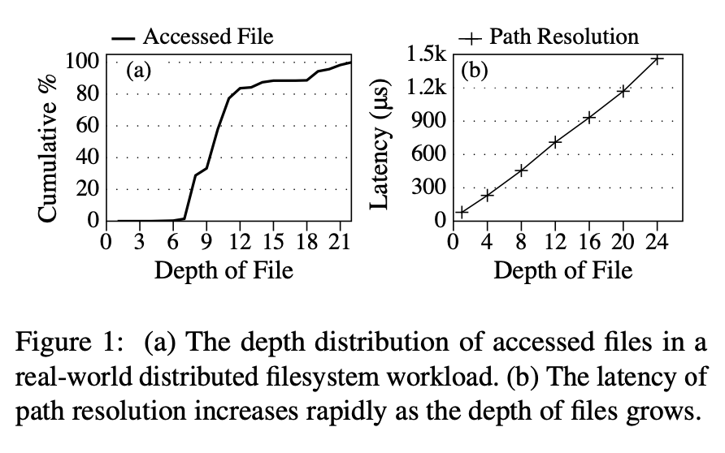
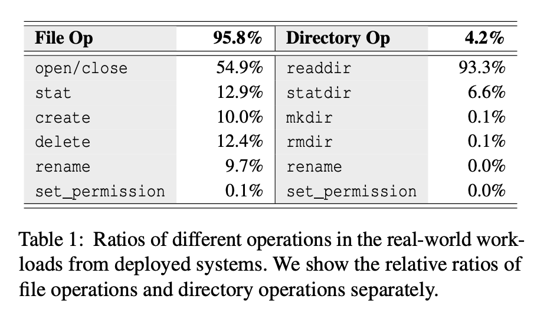
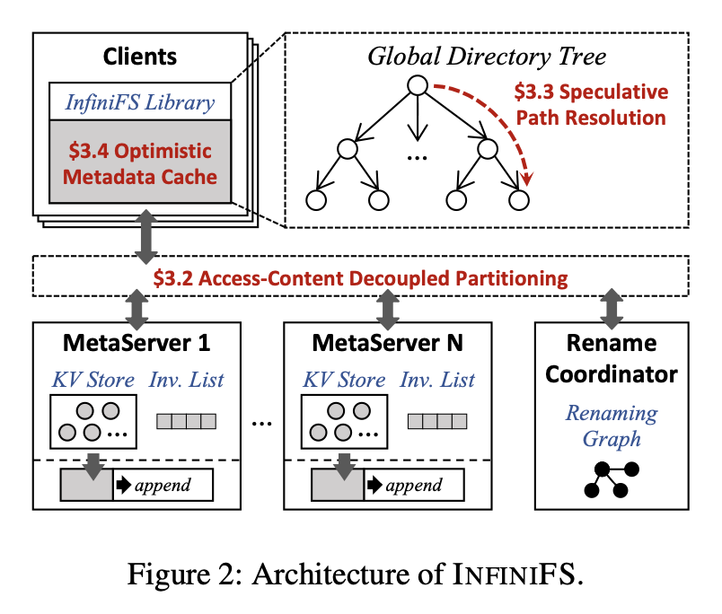

# InfiniFS: An Efficient Metadata Service for Large-Scale Distributed Filesystems

## 摘要

现代数据中心更倾向于使用一个跨越整个数据中心且支持数十亿个文件的单个文件系统实例。在这种情况下，文件系统元数据的维护面临独特的挑战，包括保留本地性的同时实现负载均衡、长路径解析和近根热点问题。

为了解决这些挑战，我们提出了 InfiniFS，一种用于极大规模分布式文件系统的高效元数据服务。它包括三个关键技术。首先，InfiniFS 将目录的*访问 (access)* 和*内容 (content)* 元数据解耦，使得目录树可以进行元数据本地化和负载均衡的分区。其次，InfiniFS 设计了可以并行遍历路径的*推测路径解析*，大大降低了元数据操作的延迟。第三，InfiniFS 在客户端引入了*乐观访问的元数据缓存*，以缓解近根热点问题，有效提高元数据操作的吞吐量。广泛的评估显示，InfiniFS 在延迟和吞吐量方面优于最先进的分布式文件系统元数据服务，并为高达 1000 亿个文件的极大规模目录树提供稳定的性能。

## 1. 介绍

对于快速扩张的企业而言，现代数据中心通常包含大量的文件，这些文件的数量很容易超出当前分布式文件系统单个实例的容量。目前，一般将数据中心划分为相对较小的集群，每个集群分别运行一个分布式文件系统实例。然而，更加理想的做法是使用一个单一的文件系统实例来管理整个数据中心，它可以提供全局数据共享、高资源利用率和低操作复杂性。例如，Facebook 引入了 Tectonic 分布式文件系统，将小型存储集群整合为一个包含数十亿个文件的单一实例。

对于分布式文件系统而言，可扩展和高效的元数据服务至关重要。现代数据中心通常包含数十亿甚至数百亿个文件，使用一个极大规模的文件系统来管理所有文件，对元数据服务带来了严峻的挑战。首先，目录树的分区既要实现高元数据本地性，又要实现良好的负载均衡，这在目录树扩展和工作负载多样化时是具有挑战性的。其次，由于极大规模文件系统中文件深度很深，路径解析的延迟可能会很高。第三，由于极大规模文件系统通常需要服务大量并发客户端，客户端元数据缓存的一致性维护开销变得无法承受。

本文提出了 InfiniFS，一个用于极大规模分布式文件系统的高效元数据服务。为了解决上述挑战，InfiniFS 通过以下设计分配文件系统目录树并加速元数据操作。

首先，我们提出了一种*访问-内容*解耦分区的方法，以实现高元数据本地性和良好的负载均衡。关键思想是将目录的访问元数据（名称、ID 和权限）和内容元数据（条目列表和时间戳）解耦，并在细粒度级别上进一步分割这些元数据对象。具体而言，我们首先将每个目录的访问元数据与其父目录配对，并将内容元数据与其子目录配对，从而实现高元数据本地性。然后，我们使用目录 ID 的一致性哈希将这些细粒度的分组分配给不同的元数据服务器，以确保良好的负载均衡。

其次，我们设计了一种*推测路径解析*方法，以并行遍历目录树，从而大大降低元数据操作的延迟。关键思想是为每个目录分配一个可预测的 ID，使客户端可以对所有中间目录的 ID 进行推测，然后并行发送多组件路径的查找 (lookup) 请求。

第三，我们引入了一种*乐观访问的元数据缓存*，以缓解近根热点问题，实现可扩展的路径解析。关键思想是在客户端缓存目录访问元数据，以减少对近根目录的频繁查找，并在低开销的元数据服务器上惰性地删除缓存条目。具体而言，目录*重命名 (rename)* 和 *目录设置权限 (set_permission)* 操作将向元数据服务器发送缓存失效通知，而不是向众多客户端发送通知，以便每个服务器在处理客户端元数据请求时惰性地验证缓存的陈旧程度。

总之，本文所做的工作如下所示：

- 我们确定了在大规模情况下影响元数据服务性能的挑战（§2）。
- 我们提出了一种高效可扩展的分布式元数据服务 InfiniFS，具有访问-内容解耦分区（§3.2）、推测路径名解析（§3.3）和乐观访问元数据缓存（§3.4）等特点。
- 我们实现并评估了 InfiniFS，证明 InfiniFS 在元数据操作延迟和吞吐量方面优于现有的分布式文件系统，并为多达 1000 亿个文件的极大规模目录树提供稳定的性能（§5）。

## 2. 背景和动机

在本节中，我们首先解释为什么拥有一个跨越整个数据中心的单一文件系统实例是令人期待的（§2.1）。然后，我们讨论了在这种情况下（超过数十亿文件）实现高效元数据服务面临的独特挑战（§2.2）。最后，我们分析了真实数据中心工作负载中元数据访问的特征（§2.3）。

### 2.1 大规模文件系统

文件系统通常为用户提供分层命名空间（即目录树）来管理文件。在目录树中，每个文件/目录都具有元数据信息。元数据操作通常涉及两个关键步骤，即路径解析和元数据处理。当用户使用路径名访问文件时，例如`/home/Alice/paper.tex`，元数据将进行如下访问：首先，文件系统执行路径解析以定位目标文件并检查用户是否具有适当的权限；然后，文件系统执行元数据处理以原子方式更新相应的元数据对象。

元数据服务是大规模分布式文件系统的可扩展性的瓶颈。分布式文件系统是数据中心的重要基础设施组件。随着数据中心内文件数量的快速增长，元数据服务成为分布式文件系统可扩展性的瓶颈。目前，数据中心通常由一系列文件系统集群组成。例如，阿里云维护了近千个盘古分布式文件系统，以共同支持数据中心内数以十亿计的文件。Facebook 也需要许多 HDFS 集群来存储单个数据中心内的数据集，因为每个 HDFS 集群由于元数据限制最多只支持 1 亿个文件。

然而，跨越整个数据中心的大规模文件系统更为理想。例如，Facebook 引入了 Tectonic 分布式文件系统，将小型存储集群整合为一个单一实例。一个数据中心内只有一个大规模文件系统在以下方面优于一系列小型文件系统集群：

**全局数据共享**：一个单一的大规模文件系统提供了一个全局命名空间，使得整个数据中心更好地进行数据共享。相比之下，在不同的集群中存储不同的数据集是低效的，需要专门的数据复制和同步。这也会使得计算服务的逻辑变得复杂，因为相关数据可能被分散在不同的文件系统中。

**高资源利用率**：全局数据共享可以消除在不同集群之间的重复数据，从而提高磁盘容量利用率。此外，单一文件系统可以更好地共享系统资源。相比之下，在多个小型文件系统集群组成的方案中，一个文件系统集群中的闲置资源无法重新分配到其他集群中。

**低操作复杂性**：一个单一的大规模文件系统可以显著降低操作复杂性，因为只需要维护一个系统。相比之下，在一个大型数据中心中维护数千个文件系统集群（如阿里云）需要大量人力并且容易出错。

### 2.2 可扩展元数据的挑战

跨越整个数据中心的单一大规模文件系统需要支持数十亿个文件并为大量客户端提供服务。这给分布式文件系统的元数据服务带来了严峻的挑战，如下所述：

**挑战 1**：*目录树分区既需要高元数据本地性，又需要良好的负载均衡，在目录树扩展和工作负载多样化的情况下，实现此目标是具有挑战性的*。

元数据本地性对于高效的元数据处理非常重要。文件系统操作通常会处理多个元数据对象。例如，文件创建操作首先锁定父目录以与目录列表操作串行化，然后原子地更新三个元数据对象，包括文件元数据、条目列表和目录时间戳。通过实现元数据本地性，我们可以避免分布式锁和分布式事务，从而实现低延迟和高吞吐量的元数据操作。

负载均衡对于实现高可扩展性非常重要。元数据操作通常会导致目录树中的负载不均衡。这在实际的数据中心工作负载中尤其如此，因为相关文件通常会被分组到子树中。连续子树中的文件和目录可能会在短时间内被频繁访问，导致存储该子树的元数据服务器出现性能瓶颈。
现有的分区策略在极大规模的场景下无法同时实现高本地性和良好的负载均衡。管理数据中心中的所有文件会导致目录树在深度和广度上迅速扩展。此外，由于文件系统支持所有数据中心服务，面临着具有不同特征的各种工作负载，这对现有的目录树分区策略来说是具有挑战性的。细粒度的分区，例如直接将元数据对象哈希到服务器上，可以实现负载均衡。然而，这会牺牲本地性，并经常导致分布式锁定，引入昂贵的协调开销，导致高延迟和低吞吐量。粗粒度的分区，例如将连续子树分组到同一服务器上，保留本地性并避免跨服务器操作。但是，它容易受到工作负载的影响而产生负载不均衡。

**挑战 2**：*路径解析的延迟可能会很高，因为在极大规模的文件系统中，文件深度很深*。

在极大规模的文件系统中，文件深度变得越来越深。先前的文件系统通常假定目录树中大多数文件的深度小于10。然而，我们发现当将所有服务合并到一个单一的文件系统中时，文件的深度迅速增加。图 1(a) 展示了实际工作负载（§2.3）中访问的文件深度分布。我们可以观察到，几乎一半的文件访问深度都超过 10。

深层目录结构对文件系统性能有很大影响。我们基于 Tectonic 的设计实现了一个简单的路径解析机制，并评估随着深度增加而增加的路径解析延迟。图 1(b) 显示，路径解析的延迟随着文件深度的增加呈线性增长。Tectonic 根据目录 ID 将目录分配到不同的元数据服务器，并因此在深度为 N 的位置解析路径需要解析 N-1 个中间目录，这导致了 N-1 个连续的网络请求。

**挑战 3**：*由于极大规模的文件系统通常需要为大量并发客户端提供服务，因此客户端元数据缓存的一致性维护开销变得不可承受*。

路径解析需要从根目录遍历目录树，并依次检查路径中所有中间目录的权限。即使在平衡的元数据操作负载下，这会导致近根目录频繁读取。文件系统吞吐量将受到存储近根目录的服务器的限制。我们在本文中称之为近根热点。许多分布式文件系统依赖于客户端元数据缓存来缓解近根热点。

然而，在极大规模的文件系统中，客户端元数据缓存会遭遇严峻的一致性维护开销。由于文件系统需要为大量并发客户端提供服务，缓存的元数据需要经常更新以保持一致性。这会导致大量的元数据同步操作和网络流量，从而降低系统的性能并增加延迟。此外，由于客户端缓存无法避免近根热点，一致性维护的开销可能会变得不可承受。因此，在极大规模的文件系统中，客户端元数据缓存的一致性维护是一个重要的挑战。

我们注意到先前的客户端缓存机制在具有大量客户端的大规模场景中效果不佳。例如，基于租约机制为每个缓存条目授予租约，该租约在固定时间后到期。当租约到期时，相应的缓存条目会自动失效。租约机制被 NFS v4、PVFS、LocoFS 和 IndexFS 广泛使用。但是在近根目录处进行缓存更新会导致租约机制负载不均衡。这是因为所有客户端都必须重复更新近根目录的缓存条目以进行路径解析。随着客户端数量的增加，近根目录的负载不均衡最终将成为性能瓶颈，并影响整体吞吐量。

### 2.3 生产级工作负载的特征

为了了解极大规模分布式文件系统的特征，我们分析了实际工作负载中元数据操作的相对频率。我们跟踪了阿里云（最大的云服务提供商之一）部署的文件系统中的元数据操作。我们捕获了三个支持不同服务的盘古文件系统实例的工作负载：数据处理与分析服务、对象存储服务和块存储服务。我们合并了来自这些不同服务的工作负载，以代表跨越整个数据中心的大规模文件系统的工作负载。元数据操作的相对频率如表 1 所示，从中我们可以观察到：

• 文件操作约占所有操作的 95.8％。  
• `readdir` 是最常见的目录操作，约占所有目录操作的 93.3％。  
• 目录重命名 (`rename`) 和设置权限 (`set_permission`) 操作很少发生，仅占所有元数据操作的 0.0083％。

这些洞察也进一步完善了我们对 InfiniFS 的设计。

## 3. 设计实现

我们设计 InfiniFS 采用以下三个关键思想：

- **解耦目录元数据**：InfiniFS 将目录元数据划分为目录本身的访问状态（名称、ID 和权限）和与子目录相关的内容状态（条目列表和时间戳），因此可以对其进行细粒度的划分以进行负载均衡，同时仍保留针对常见操作（如 `create`、`delete` 和 `readdir`）的元数据处理的良好局部性。

- **在路径解析中推测目录 ID**：InfiniFS 对每个目录使用可预测的 ID，该 ID 基于父 ID、名称和版本号的哈希密码。这使得客户端可以推测目录 ID 并并行启动多组件路径的查找。

- **惰性移除客户端无效缓存**：InfiniFS 在客户端上缓存目录访问元数据，以避免近根热点问题，从而实现可扩展的路径解析。客户端使用缓存条目进行路径解析，不关心它们是否过时。当处理客户端元数据请求时，元数据服务器会延迟验证缓存的新旧程度。

### 3.1 概述

InfiniFS 是一种高效的元数据服务，适用于极大规模的分布式文件系统。图 2 展示了InfiniFS 的架构，包含以下组件：

- **客户端**：InfiniFS 提供一个由客户端共享的全局文件系统目录树。客户端通过用户空间库或 Fuse 用户级文件系统与 InfiniFS 联系。它们通过推测路径解析（§3.3）遍历目录树，通过预测目录 ID 并并行查找来最小化延迟。在路径解析期间，客户端使用乐观的元数据缓存（§3.4）来缓解近根目录的过度读取负载。

- **元数据服务器**：文件系统目录树通过访问-内容解耦（§3.2）在元数据服务器之间分区分布，从而实现高元数据局部性和良好的负载均衡。每个服务器在本地键值存储中管理元数据对象（即 KV 存储），通常在内存中缓存元数据并在 NVMe SSD 上记录更新以实现高性能。元数据服务器使用无效列表（即 Invalidation List）来延迟验证客户端元数据请求。

- **重命名协调器**：一个中央重命名协调器用于处理目录重命名和目录设置权限操作。它使用重命名图 (renaming graph) 来检查并发目录重命名，以防止孤立的循环（§4.1），并向元数据服务器的无效列表广播修改信息。

## 3.2 访问-内容解耦分区

在本节中，我们首先解释为什么要解耦访问和内容元数据。然后，我们展示如何通过**分组**实现元数据局部性，并通过**分区**实现负载均衡。最后，我们展示如何将元数据存储在键值对中。

**解耦目录元数据**：如 §2.2 所讨论的那样，以前的细粒度和粗粒度分区无法同时实现高元数据局部性和良好的负载均衡。本质上，根本原因在于它们将目录元数据视为一个整体。因此，在对目录树进行分区时，它们必须将目录从其父目录或其子目录中分割到不同的服务器上，这会无意中破坏相关元数据的局部性。

我们分析了目录元数据的组成，并发现目录元数据由两个独立的部分组成：访问和内容。如图 3(b) 所示，访问元数据包含目录名称、ID 和权限，用于访问目录树。内容元数据包含条目列表、时间戳等，与子目录相关。因此，我们建议将目录元数据拆分为访问和内容两部分，以便独立地对两部分进行分组和分区，以实现元数据局部性和负载均衡。

**局部性分组**：我们将相关的元数据对象分组到同一个元数据服务器，以实现元数据处理阶段的高局部性。我们首先分析每一种元数据操作的必要条件，以确定元数据处理期间涉及的相关元数据对象。我们将元数据操作分为以下三类：

1. 仅处理目标文件（或目录）元数据的操作，例如 `open`、`close` 和 `stat`。例如，文件统计（`stat`）仅读取目标文件的元数据。
2. 处理目标文件（或目录）及其父目录元数据的操作，例如 `create`、`delete` 和 `readdir`。例如，文件创建将首先插入文件元数据，然后锁定并更新父目录的条目列表和时间戳。
3. `rename` 操作比较特殊，因为它处理两个文件（或目录）及其父目录的元数据。

我们观察到大多数元数据操作（1 和 2）在元数据处理期间需要目标文件（或目录）和父目录的元数据。如图 3(c) 所示，通过解耦目录元数据，我们将每个目录的内容元数据及其子目录的访问元数据以及文件元数据进行分组。这样，我们将目录树分割成独立的每个目录组，以进行后续的分区，同时保留 `readdir` 和文件 `create`/`delete`/`open`/`close`/`stat`/`set_permission` 操作的元数据局部性。根据元数据操作的相对频率（表 1），这些操作约占所有操作的 90％。因此，InfiniFS 为大多数元数据操作实现了高局部性。

**分区以实现负载均衡**：我们进一步对目录树进行细粒度分区，以实现良好的负载均衡。基于感知局部性的元数据分组，我们将目录树分割成独立的单个目录组，然后通过对目录 ID 进行哈希将这些组分区到不同的元数据服务器。这种细粒度的哈希分区可以有效地均衡元数据操作的负载。

我们在图 3(c) 中说明了分区过程。包含 C 的内容元数据和 f1 和 f2 的元数据的元数据组被分区到元数据服务器 1。这样，在 C 下创建文件只需要在元数据服务器 1 中进行本地事务来插入新的文件元数据，然后更新 C 的条目列表和时间戳。对 C 的读取目录只涉及元数据服务器 1，首先锁定目录条目列表以进行隔离，然后从条目列表中读取文件名。InfiniFS 还利用一致性哈希将这些细粒度的元数据组映射到服务器，以便在集群扩缩容时最小化迁移。

**存储**：我们使用 KV 存储作为后端存储实现访问-内容解耦分区。键值索引方案详见表 2，由三种类型的键值对组成，两种用于目录访问和内容元数据，另一种用于文件元数据。为了解析 `/A/B/file`（假设`/`、`A`和`B`的 ID 分别为 0、1 和 2），我们首先使用`⟨0，A⟩`作为键来获取 A 的访问元数据，并发现 A 的 ID 等于 1。然后，我们使用`⟨1，B⟩`获取 B 的访问元数据，并发现 B 的 ID 等于 2。最后，我们使用`⟨2⟩`来获取 B 的内容元数据，并使用`⟨2，file⟩`来获取文件的元数据。